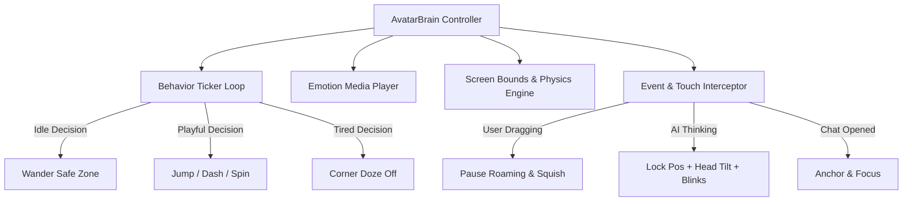

# 🐾 Orbital Living Avatar System: Master Architectural & Execution Plan

A complete technical and design blueprint for building a high-personality, game-tier autonomous companion avatar for Android while **strictly keeping APK size small (< 15–20 MB)** and ensuring 60 FPS performance without battery drain.

---

## 🎯 1. Core Vision & Goals
1. **Living Personality**: An expressive screen pet that wanders, plays, snoozes, blinks, thinks, and reacts to the user like a game NPC.
2. **Zero Bloat (Lightweight APK)**: Keep the complete avatar asset footprint under **3–5 MB total** across all characters.
3. **Smooth 60 FPS Performance**: Hardware-accelerated rendering with low CPU/RAM overhead and zero background battery drain when the screen is locked.
4. **Extensibility**: Support on-demand downloaded skins/characters without requiring app updates.

---

## 📉 2. How to Avoid App Size Bloat (The Zero-Bloat Strategy)

If we add raw 1080p video clips or large uncompressed GIF files for 10 emotions across multiple characters, the app size would explode by 100MB+. 

Here is the exact **4-tier optimization pipeline** to keep the app ultra-small:

```
┌────────────────────────────────────────────────────────────────────────┐
│                   🛡️ ZERO-BLOAT ASSET PIPELINE                         │
├────────────────────────────┬───────────────────────────────────────────┤
│ 1. Optimal Render Bounds   │ 288×288 px target resolution (52-80dp)    │
│ 2. Procedural Code Physics │ Math-driven bobbing, squash, blinks (0 KB)│
│ 3. Keyframe Delta WebP     │ Multi-frame WebP with frame diffing (70KB)│
│ 4. Dynamic Cloud Delivery  │ Extra characters downloaded on-demand     │
└────────────────────────────┴───────────────────────────────────────────┘
```

### 1. Optimal Canvas Resolution (288×288 px)
- The overlay avatar is displayed at `52dp` to `80dp` on screen.
- On a high-density 4K phone display (`xxxhdpi` / 3.5x–4.0x), `80dp` = **280px–320px**.
- **Rule**: Never use 1024px or 2048px assets for the bubble. Standardizing all frames to **288×288 px** retains 100% retina clarity while reducing asset weight by **85%**.

### 2. Hybrid Procedural Animation (Code-Driven + Sprite Swaps)
Instead of baking long 5-second video files for every minor movement, we split animations into **Math Code** vs **Sprite Assets**:

| Animation Type | How it's Handled | File Size Added |
|---|---|---|
| **Breathing Bobbing** | `ValueAnimator` sinusoidal vertical offset | **0 KB** (Pure Kotlin) |
| **Squash & Stretch** | Dynamic `scaleX` / `scaleY` on jumps & landings | **0 KB** (Pure Kotlin) |
| **Walking Steps** | Code-driven tilt oscillation + 2-frame foot step | **< 30 KB** |
| **Eye Blinking** | Scale-Y eyelid squish / alpha switch | **0 KB** (Pure Kotlin) |
| **Screen Movement** | `WindowManager` coordinate path interpolation | **0 KB** (Pure Kotlin) |
| **Emotion Clips (Think, Jump, Celeb)** | Ultra-compressed looping WebP | **~50–80 KB each** |

### 3. WebP Lossless Alpha + Frame Diffing
- WebP supports **inter-frame delta compression** (only storing pixels that move between frame 1 and frame 2).
- At 15–20 FPS, a 2.5-second loop requires only 25–35 KB to 80 KB.
- **Result**: 8 complete emotional animation loops per character = **~500 KB total per character!**

### 4. Bundled Starter Character + Dynamic Cloud Skins
- **In-APK**: Bundle only the default character (`Aether`).
- **Additional Characters (`Lumy`, `Volo`, Seasonal Skins)**: Downloaded on-demand into `context.filesDir/avatars/` when the user selects them in the Character Picker.

---

## 🧠 3. Avatar "Tiny Brain" State Machine Architecture

The avatar behavior engine is structured into 4 decoupled subsystems:



### State Definitions & Triggers

| State | Trigger | Movement / Visual Action |
|---|---|---|
| `IDLE` | Default inactive state | Subtle floating bob, periodic natural blinks every 3-5s |
| `WANDERING` | Autonomous decision (40% chance) | Flips facing direction (`scaleX`), walks to random safe screen point with step wobble |
| `DASH / RUN` | Playful decision (15% chance) | Fast horizontal dash across screen with squash & stretch |
| `PLAYFUL_HOP` | Playful decision (20% chance) | Double hop in place with joyful bounce |
| `LOOK_AROUND` | Curious decision (15% chance) | Head tilts left/right, curiosity eyes |
| `THINKING` | AI Prompt sent / Voice listening | Pauses movement, tilts head, rapid concentrated blinks, question particle aura |
| `WORKING` | Action / Tool execution | Typing on hologram tablet, energetic pulse |
| `CELEBRATING` | Action finished / Task complete | Golden stars / Confetti, victory jump |
| `SLEEPING` | 2.5+ mins without interaction | Corners itself, slow deep breathing, floating "Zzz" |
| `DRAGGED` | User touches & moves avatar | Immediate physics squash (`scaleX=1.15, scaleY=0.88`), cancels roaming |

---

## 📋 4. Step-by-Step Implementation Roadmap

```
PHASE 1: Master Asset Pipeline & Image Generation
├── Generate clean 3D character keyframes using AVATAR_PROMPTS.md
├── Auto-remove white backgrounds (clean alpha cutout)
└── Resize and optimize to 288x288 px

PHASE 2: Automated WebP Animation Compiler
├── Run python generate_webp_animations.py with frame-diffing
└── Generate ultra-compact (50-80KB) looping WebPs in res/raw/

PHASE 3: Emotion Media Engine & Compose Sync
├── Enhance EmotionMediaLoader to support both res/raw and downloaded filesDir
└── Hook into AnimatedMascotView (In-App) and OverlayService (Floating Bubble)

PHASE 4: AvatarBrain Physics & Personality Refinement
├── Fine-tune screen collision bounds (status bar, navigation bar avoidance)
├── Directional facing flips (scaleX interpolation)
└── Reaction interrupts for Voice, Streaming Chat, and Dragging

---

## 🛡️ 5. Critical System & UX Safeguards

```
┌────────────────────────────────────────────────────────────────────────┐
│                   📱 PRODUCTION SAFEGUARD MATRIX                       │
├────────────────────────────┬───────────────────────────────────────────┤
│ 1. Screen Lock Sleep       │ ACTION_SCREEN_OFF -> 0% CPU Freeze        │
│ 2. Soft Keyboard Avoidance │ Retracts to edge/top when typing appears  │
│ 3. Fullscreen / Game Mode  │ Auto-docks to bottom edge in Landscape    │
│ 4. Out-of-Screen Peeking   │ 60% hidden off-screen (Accessibility tab) │
│ 5. Audio Policy (Silent)   │ Sound OFF by default, non-intrusive       │
└────────────────────────────┴───────────────────────────────────────────┘
```

### 1. Screen Lock Sleep (0% Battery Consumption)
- **Lifecycle Receiver**: Listens to `Intent.ACTION_SCREEN_OFF` and `Intent.ACTION_SCREEN_ON`.
- **Behavior**: When the screen turns OFF, immediately cancels all roaming animators, pauses WebP frame rendering, and suspends the decision ticker loop.
- **Wake-up**: When the phone is unlocked (`ACTION_SCREEN_ON`), gently stretches and resumes the idle breathing loop.

### 2. Keyboard (IME) Auto-Retreat
- **Detection**: Monitor window insets and soft input changes.
- **Behavior**: When the keyboard opens, the avatar smoothly glides away to the top corner / screen border so it **never covers text fields or the send button**.
- **Background Execution**: Background AI tasks & automation continue executing seamlessly without blocking the user.

### 3. Fullscreen & Landscape Auto-Dock
- **Detection**: `Configuration.ORIENTATION_LANDSCAPE` or fullscreen game/video flags.
- **Behavior**: Automatically tucks away to the bottom edge or corner with reduced opacity (`0.4f`), ensuring zero obstruction of subtitles or game controls.

### 4. Out-of-Screen Edge Peeking (Accessibility Side-Handle)
- **Edge Docking**: When idle or tucked away, the avatar can sit **50%–60% outside the screen frame**, with only its cute head/eyes peeking in (similar to Samsung Edge Panel / Android Accessibility button).
- **Quick Pull**: A gentle tap or drag pulls the avatar back into full view with a playful bounce.

### 5. Silent-by-Default Audio Policy
- **Zero Annoyance**: All sounds and speech effects are **OFF by default** so the companion never makes unexpected noises in public, meetings, or quiet spaces.
- **Optional & Subtle**: If enabled manually in Settings, SFX are kept at a soft, gentle volume with a one-tap master mute switch.

---

## 📋 6. Master Step-by-Step Roadmap

```
PHASE 1: Master Asset Pipeline & Image Generation
├── Generate clean 3D character keyframes using AVATAR_PROMPTS.md
├── Auto-remove white backgrounds (clean alpha cutout)
└── Standardize and optimize to 288x288 px

PHASE 2: Automated WebP Animation Compiler
├── Run python generate_webp_animations.py with frame-diffing
└── Generate ultra-compact (50-80KB) looping WebPs in res/raw/

PHASE 3: Emotion Media Engine & Zero-Bloat Loader
├── EmotionMediaLoader handles both res/raw and on-demand storage
└── Integrated with AnimatedMascotView and OverlayService

PHASE 4: Autonomous Brain & Screen Physics
├── Screen collision bounds & directional facing flips (scaleX)
├── Edge Peeking & Out-of-Screen Docking Handle
└── Screen Lock Sleep & Keyboard Auto-Retreat

PHASE 5: On-Demand Cloud Character Downloader
└── Cache remote character skins on-demand (APK stays < 15-20 MB)
```

---

## 🛠️ 7. Next Immediate Actions

1. **Generate Master Character Images**: Use the prompts in [`AVATAR_PROMPTS.md`](file:///c:/Jay/dev/Orbital/AVATAR_PROMPTS.md) with Google Flow / Imagen to produce the core emotion PNGs.
2. **Compile Optimized WebP Loops**: Drop the transparent PNGs into `res/drawable/` and run `python generate_webp_animations.py`.
3. **Live Engine Ready**: The engine in [`AvatarBrain.kt`](file:///c:/Jay/dev/Orbital/app/src/main/java/com/orbital/overlay/AvatarBrain.kt) and [`EmotionMediaLoader.kt`](file:///c:/Jay/dev/Orbital/app/src/main/java/com/orbital/ui/EmotionMediaLoader.kt) will automatically load and run the animations.
