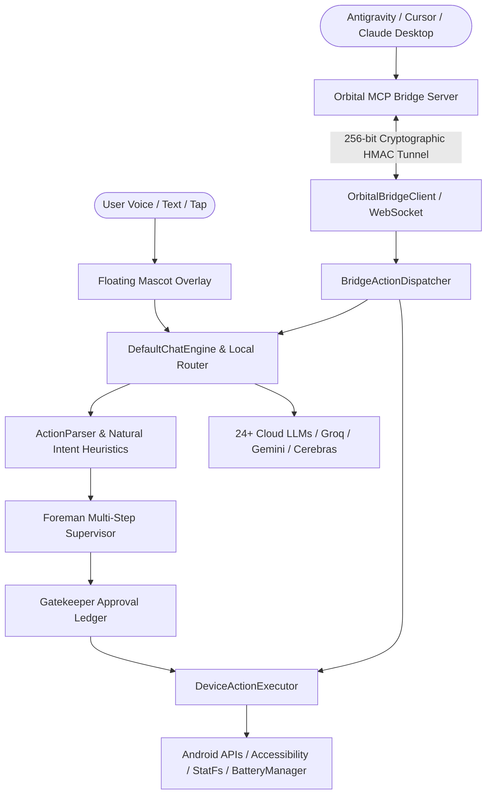

# 🛰️ Orbital — Autonomous Floating AI Companion & MCP Mobile Bridge for Android

<div align="center">

[](https://github.com/jaypal1046/Orbital/releases)
[](https://github.com/jaypal1046/Orbital/actions)
[](https://kotlinlang.org/)
[-green?style=for-the-badge&logo=android)](https://developer.android.com/)
[-blue?style=for-the-badge)](https://modelcontextprotocol.io/)
[](LICENSE)

**Orbital** is an always-on, client-side executive AI companion and Model Context Protocol (MCP) bridge for Android. It seamlessly lives as a floating mascot overlay on your screen, performs deep on-device automations, and connects wirelessly to IDEs (Antigravity, Cursor, VS Code, Claude Desktop) for autonomous mobile control.

</div>

---

## 🌟 Key Highlights

- 🛰️ **Wireless Model Context Protocol (MCP) Bridge**: Control, inspect, and test your Android device wirelessly over encrypted WebSockets using native MCP tool calls.
- ⚡ **Zero-Latency Edge Intent Resolution**: Instant offline resolution of device commands (battery, storage, flashlights, timers, apps) without requiring cloud LLM latency.
- 🔋 **Live Hardware & Thermal Diagnostics**: Real-time battery status, charging indicator, device temperature (°C), available internal storage metrics (`StatFs`), and hardware device details.
- 🧠 **Foreman Multi-Step Supervisor**: Dynamic planning and visual execution timeline with interactive Gatekeeper approval dialogs (`ALWAYS_PROCEED`, `REQUEST_FOR_ACTION`, `AUTO_SAFE`).
- 🌌 **Mobile Skills Architecture (Antigravity on Device)**: Modular capability bundles (System Automations, App Integrations, Assistant Tools) dynamically injected into the AI context window.
- 🔒 **Zero-Compromise Financial Safety**: Strict, tamper-proof background shielding that instantly freezes and hides the companion when banking or payment apps are opened.
- 🎭 **Animated Mascot Personalities**: State-driven floating companions (**Aether**, **Lumy**, **Volo**) with custom sprite animations, mood reactions, and smooth spring physics.
- 🌐 **24+ Multi-Provider LLM Auto-Router**: Smart speed-tiering, auto-failover, and keyless provider routing across Groq, Gemini 2.0/3.6, Cerebras, OpenRouter, NVIDIA NIM, Mistral, Pollinations, and Ollama.

---

## 🏗️ Architecture Overview



---

## 🔌 Model Context Protocol (MCP) Tools

Orbital provides a first-class MCP server (`tools/orbital-mcp`) that exposes native tools for AI coding assistants and automation agents:

| MCP Tool | Description |
| :--- | :--- |
| `inspect_phone_screen` | Captures real-time accessibility hierarchy nodes, bounding boxes, text, and clickability states. |
| `tap_phone_element` | Taps any interactive UI element by exact text, label, or coordinate bounds. |
| `type_phone_text` | Types text into active input fields, search bars, or chat prompts. |
| `open_phone_app` | Dynamically launches any installed package or app name on the device. |
| `press_phone_key` | Sends global system key events (`BACK`, `HOME`, `RECENTS`, `VOLUME_UP`, etc.). |
| `ask_phone_ai` | Delegates autonomous, natural language goals directly to the on-device Orbital AI engine. |
| `assert_screen_contains`| Verifies that expected text, state, or UI elements are rendered on screen. |

---

## 🚀 Getting Started

### 1. Download & Install Android App

Download the latest APK from the [Releases Page](https://github.com/jaypal1046/Orbital/releases):
```bash
adb install orbital-v1.0.3.apk
```

Or build from source:
```bash
./gradlew assembleDebug
./gradlew installDebug
```

### 2. Configure MCP Server in your IDE

Add Orbital to your IDE's MCP configuration (`mcp_config.json` or `claude_desktop_config.json`):

```json
{
  "mcpServers": {
    "orbital-phone": {
      "command": "node",
      "args": ["path/to/Orbital/tools/orbital-mcp/index.js"]
    }
  }
}
```

### 3. Pair Device
1. Open the Orbital app and navigate to **🛰️ Laptop AI Bridge**.
2. Scan the pairing QR code or connect directly to your laptop's local IP address and port `8765`.
3. The bridge establishes a secure, 256-bit cryptographic session with instant auto-reconnect.

---

## 📱 Executive Device Actions

Orbital can execute deep device actions directly on your phone:

- **Battery & System Health**: Live battery percentage, charging state, thermal sensor readout, available storage (`StatFs`).
- **Hardware Toggles**: Flashlight control, ringer modes (`silent`, `vibrate`, `normal`), volume sliders.
- **System Settings**: Wi-Fi, Bluetooth, Battery Saver, Display, Accessibility, Application manager.
- **Application Controls**: Search inside YouTube, play songs on Spotify, navigate on Google Maps, compose emails, send WhatsApp messages.
- **Clock & Organization**: Set countdown timers, create calendar events, configure morning alarms.

---

## 🛡️ Security & Privacy Guarantee

- **Zero-Compromise Payment Protection**: Hardcoded background monitor detects financial, UPI, and banking apps (Google Pay, Paytm, PhonePe, BHIM, bank portals) and immediately freezes and conceals the companion.
- **Hardware-Backed Encryption**: All API keys, tokens, and credentials are encrypted using the Android Keystore (`EncryptedSharedPreferences`).
- **Cryptographic Message Signatures**: Remote bridge communication is verified with HMAC-SHA256 signatures to prevent unauthorized network injections.
- **Local Tamper Detection**: App integrity checks inspect signature fingerprints, debuggable flags, and runtime hooks.

---

## 🧪 Testing & Verification

Run the comprehensive unit test suite:
```bash
./gradlew testDebugUnitTest
```

Verify build packaging:
```bash
./gradlew assembleRelease
```

---

## 📄 License

This project is licensed under the **MIT License** — see the [LICENSE](LICENSE) file for details.

<div align="center">
Built with ❤️ for intelligent, autonomous, and secure mobile AI interaction.
</div>