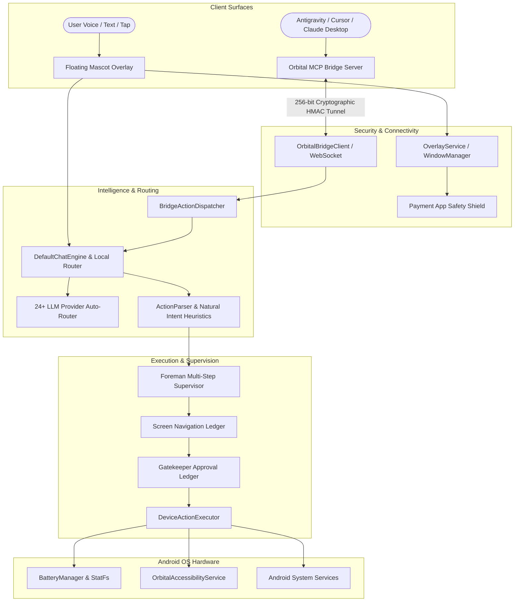

# 🛰️ Orbital — Autonomous Floating AI Companion & MCP Mobile Bridge for Android

<div align="center">

[](https://github.com/jaypal1046/Orbital/releases)
[](https://github.com/jaypal1046/Orbital/actions)
[](https://kotlinlang.org/)
[-green?style=for-the-badge&logo=android)](https://developer.android.com/)
[-blue?style=for-the-badge)](https://modelcontextprotocol.io/)
[](LICENSE)

**Orbital** is a next-generation, client-side executive AI companion and Model Context Protocol (MCP) bridge for Android. Operating as an always-on floating mascot on your screen, it executes real on-device actions, monitors system health, and interfaces directly with developer IDEs (Antigravity, Cursor, Claude Desktop, VS Code) for wireless, autonomous mobile control and automated app testing.

</div>

---

## 📑 Table of Contents

- [🌟 Key Highlights](#-key-highlights)
- [🏗️ Architectural Blueprint](#-architectural-blueprint)
- [🔌 Model Context Protocol (MCP) Bridge](#-model-context-protocol-mcp-bridge)
- [🌌 Mobile Skills Framework](#-mobile-skills-framework)
- [🧠 Foreman Multi-Step Supervisor & Gatekeeper](#-foreman-multi-step-supervisor--gatekeeper)
- [🔋 Real-Time Hardware & Thermal Diagnostics](#-real-time-hardware--thermal-diagnostics)
- [🎭 Mascot Personalities & Emotion Engine](#-mascot-personalities--emotion-engine)
- [🌐 24+ Multi-Provider LLM Auto-Router](#-24-multi-provider-llm-auto-router)
- [🛡️ Security, Safety & Privacy Guarantee](#-security-safety--privacy-guarantee)
- [📂 Comprehensive Project Directory Tree](#-comprehensive-project-directory-tree)
- [🚀 Getting Started & Pairing Guide](#-getting-started--pairing-guide)
- [🧪 Testing & Verification](#-testing--verification)
- [📄 License](#-license)

---

## 🌟 Key Highlights

- 🛰️ **Wireless Model Context Protocol (MCP) Bridge**: Control, inspect, and test your Android device wirelessly over encrypted WebSockets using native MCP tool calls.
- ⚡ **Zero-Latency Edge Intent Resolution**: Instant offline resolution of device commands (battery, storage, flashlights, timers, apps) without cloud LLM latency.
- 🔋 **Live Hardware & Thermal Diagnostics**: Real-time battery status, charging indicator, device temperature (°C), available internal storage metrics (`StatFs`), and hardware device metadata.
- 🧠 **Foreman Multi-Step Supervisor**: Dynamic planning and visual execution timeline with interactive Gatekeeper approval dialogs (`ALWAYS_PROCEED`, `REQUEST_FOR_ACTION`, `AUTO_SAFE`).
- 🌌 **Mobile Skills Architecture (Antigravity on Device)**: Modular capability bundles (System Automations, App Integrations, Assistant Tools) dynamically injected into the AI context window.
- 🔒 **Zero-Compromise Financial Safety**: Strict, tamper-proof background shielding that instantly freezes and hides the companion when banking or payment apps are opened.
- 🎭 **Animated Mascot Personalities**: State-driven floating companions (**Aether**, **Lumy**, **Volo**) with custom sprite animations, mood reactions, and smooth spring physics.
- 🌐 **24+ Multi-Provider LLM Auto-Router**: Smart speed-tiering, auto-failover, and keyless provider routing across Groq, Gemini 2.0/3.6, Cerebras, OpenRouter, NVIDIA NIM, Mistral, Pollinations, and Ollama.

---

## 🏗️ Architectural Blueprint



---

## 🔌 Model Context Protocol (MCP) Bridge

Orbital embeds an enterprise-grade MCP server (`tools/orbital-mcp`) that exposes 13 native tools for AI coding assistants (**Antigravity, Cursor, Claude Desktop, Windsurf, VS Code**):

> [!TIP]
> **Zero-Install Quick Start**: Run `npx -y orbital-mcp` to launch the bridge host immediately without cloning the entire Android codebase!

| # | MCP Tool | Input Parameters | Description |
| :--- | :--- | :--- | :--- |
| 1 | `inspect_phone_screen` | _None_ | Captures real-time accessibility hierarchy nodes, bounding boxes, text labels, and clickability states. |
| 2 | `tap_phone_element` | `targetText`, `targetId` | Taps interactive UI elements matching exact text or resource ID. |
| 3 | `tap_phone_coordinates` | `x`, `y` | Taps exact pixel coordinates on the phone screen. |
| 4 | `type_phone_text` | `text`, `targetLabel` | Enters text into focused or targeted input fields. |
| 5 | `open_phone_app` | `packageName` | Dynamically launches installed applications by name or package ID. |
| 6 | `swipe_phone_screen` | `direction`, `startX/Y`, `endX/Y` | Scrolls or gestures across the screen in any direction or custom vector. |
| 7 | `press_phone_key` | `key` (`BACK`, `HOME`, `RECENTS`, etc.) | Triggers global Android navigation and hardware keys. |
| 8 | `execute_device_action` | `action`, `target`, `query`, `enabled` | Controls system toggles (`FLASHLIGHT`, `DEVICE_STATUS`, `SET_SOUND_MODE`, `OPEN_SETTING`, `SET_TIMER`, `SEARCH_WEB`, `OPEN_URL`). |
| 9 | `assert_screen_contains`| `expectedText` | Asserts that specific text or element exists on the screen for test verification. |
| 10 | `ask_phone_ai` | `prompt`, `sessionTitle` | Delegates high-level natural language goals to the on-device Orbital AI companion. |
| 11 | `execute_phone_task_batch` | `planTitle`, `steps[]`, `stopOnError` | Executes multi-step batch interaction plans in a single round-trip with post-step assertions and telemetry. |
| 12 | `manage_phone_session` | `command`, `sessionId`, `title` | Manages persistent on-device Room-backed chat and execution sessions. |
| 13 | `explore_and_analyze_app` | `appName` | Autonomously explores any app, analyzes spatial layout, and generates UX/product reports. |

---

## 🌌 Mobile Skills Framework

Orbital incorporates a modular **Mobile Skills System** inspired by Antigravity's skill architecture. Skills can be dynamically toggled in the app drawer or injected into the AI context window:

```
Mobile Skills Registry
├── ⚙️ System Automation: Controls Flashlight, Volume, Wi-Fi, Bluetooth, Screen, and Hardware Toggles
├── 🛠️ Assistant Tools: Manages Countdowns, Alarms, Calendar Events, Device Diagnostics, and Settings
├── 📱 App Integration: Deep searches within YouTube, Spotify, Maps, Gmail, and Messaging apps
└── 🎵 Media Controller: Streams songs, artists, playlists, and audio across media providers
```

---

## 🧠 Foreman Multi-Step Supervisor & Gatekeeper

For complex multi-action tasks, Orbital utilizes the **Foreman Supervisor**:

1. **Step-by-Step Execution Planning**: Breaks user goals into sequential sub-tasks.
2. **Screen Navigation Ledger**: Detects missing parameters and formulates clarifying questions dynamically before execution.
3. **Gatekeeper Approval Modes**:
   - `ALWAYS_PROCEED`: Executes all system and app actions immediately.
   - `REQUEST_FOR_ACTION`: Displays a visual approval card with **Proceed** and **Cancel** buttons before sensitive actions.
   - `AUTO_SAFE`: Automatically proceeds with safe queries while requiring explicit confirmation for calls, messages, and settings changes.

---

## 🔋 Real-Time Hardware & Thermal Diagnostics

Orbital queries native Android APIs for hardware diagnostics:

- **Battery Percentage & State**: Reads real-time capacity from `BatteryManager.BATTERY_PROPERTY_CAPACITY` and sticky `ACTION_BATTERY_CHANGED`.
- **Thermal Sensors**: Monitors battery temperature in real-time (°C).
- **Internal Storage**: Calculates available and total disk capacity using `android.os.StatFs`.
- **Hardware Metadata**: Formats device model (`Build.MODEL`), manufacturer, and Android OS version.

---

## 🎭 Mascot Personalities & Emotion Engine

Orbital features customizable companions with state-driven emotion animations:

- **Aether**: Cosmic traveler with serene particle fields and futuristic shields.
- **Lumy**: Cheerful light spirit with warm, gentle micro-animations.
- **Volo**: Swift wind explorer with high-energy kinetic reactions.

### Supported Emotion States
- `IDLE` • `THINKING` • `WORKING` • `CELEBRATING` • `HAPPY` • `CURIOUS` • `SLEEP` • `LOW_BATTERY`

---

## 🌐 24+ Multi-Provider LLM Auto-Router

Orbital supports direct integration with 24+ leading LLM inference backends with automatic failover:

| Tier | Providers | Characteristics |
| :--- | :--- | :--- |
| **Ultra-Fast Speed** | **Groq**, **Cerebras**, **SambaNova** | Sub-300ms time-to-first-token, Llama 3.3 70B, Qwen 2.5 Coder |
| **Frontier Reasoning**| **Google Gemini (2.0/3.6)**, **OpenRouter**, **DeepSeek R1** | Deep multi-step reasoning, massive 1M+ context window |
| **Keyless / Open** | **Pollinations**, **Kilo**, **OVH**, **AI Horde** | Instant access with zero configuration or API keys required |
| **Self-Hosted** | **Ollama**, **Local HTTP Server (Port 3001)** | 100% private, on-device or local network inference |

---

## 🛡️ Security, Safety & Privacy Guarantee

- **Strict Payment Shield**: Hardcoded background monitor detects financial, banking, and UPI apps (Google Pay, PhonePe, Paytm, BHIM, bank apps) and immediately conceals the floating companion.
- **Android Keystore Encryption**: All credentials and API keys are protected using AES-256-GCM via `EncryptedSharedPreferences`.
- **HMAC-SHA256 Signatures**: Remote MCP commands are verified using cryptographic signatures to eliminate unauthorized remote calls.
- **Zero Hardcoding**: All dynamic app resolutions, queries, and execution paths are computed from runtime system states.

---

## 📂 Comprehensive Project Directory Tree

```
Orbital/
├── .github/workflows/           # CI/CD workflows for testing and GitHub Releases
│   ├── release.yml              # Automated APK compilation & release publishing
│   └── publish_mcp.yml          # MCP server packaging
├── app/src/main/java/com/orbital/
│   ├── action/                  # DeviceActionExecutor, ActionParser, ActionRegistry
│   ├── automation/              # OrbitalAccessibilityService, Screen Hierarchy
│   ├── bridge/                  # OrbitalBridgeClient, BridgeActionDispatcher, CryptoAuth
│   ├── chat/                    # DefaultChatEngine, StreamingClient, Multi-Router
│   ├── data/                    # SecureStorage, SQLite Database, LLM Repository
│   ├── foreman/                 # ForemanSupervisor, ExecutionTracker, Step Planning
│   ├── memory/                  # HindsightMemoryEngine (Habits, Preferences, Quirks)
│   ├── overlay/                 # OverlayService (WindowManager), Mascot Sprites
│   ├── power/                   # PowerAwareScheduler, WorkManager Automations
│   ├── safety/                  # PaymentAppShield, TamperDetector
│   ├── skills/                  # MobileSkillRegistry, Modular AI Skills
│   └── ui/                      # Jetpack Compose UI (Chat, Drawers, Automation Settings)
└── tools/orbital-mcp/           # Official Node.js Model Context Protocol Server
    ├── index.js                 # MCP Tool handlers & WebSocket bridge client
    └── package.json             # MCP dependencies & configuration
```

---

## 🚀 Getting Started & Pairing Guide

### 1. Download & Install Android App

Download the latest APK from the [Releases Page](https://github.com/jaypal1046/Orbital/releases):
```bash
adb install orbital-v1.0.3.apk
```

Or build from source:
```bash
./gradlew assembleDebug
./gradlew installDebug
```

### 2. Configure MCP Server in your IDE

Add Orbital to your IDE's MCP configuration (`mcp_config.json` or `claude_desktop_config.json`):

```json
{
  "mcpServers": {
    "orbital-phone": {
      "command": "node",
      "args": ["c:/Jay/dev/Orbital/tools/orbital-mcp/index.js"]
    }
  }
}
```

### 3. Pair Device
1. Open the Orbital app and navigate to **🛰️ Laptop AI Bridge**.
2. Scan the pairing QR code or connect directly to your laptop's local IP address and port `8765`.
3. The bridge establishes a secure, 256-bit cryptographic session with instant auto-reconnect.

---

## 🧪 Testing & Verification

Run the comprehensive unit test suite:
```bash
./gradlew testDebugUnitTest
```

Verify build packaging:
```bash
./gradlew assembleRelease
```

---

## 🌐 Ecosystem Repositories

- **🛰️ Dedicated MCP Server**: [https://github.com/jaypal1046/orbital_mcp](https://github.com/jaypal1046/orbital_mcp) (Standalone MCP bridge for developers who only need the desktop MCP tool)
- **🔒 Privacy Policy & Security Terms**: [https://github.com/jaypal1046/orbital_policy](https://github.com/jaypal1046/orbital_policy) (Compliance, data isolation, and financial shielding policy)

---

## 📄 License

This project is licensed under the **MIT License** — see the [LICENSE](LICENSE) file for details.

<div align="center">
Built with ❤️ for intelligent, autonomous, and secure mobile AI interaction.
</div>