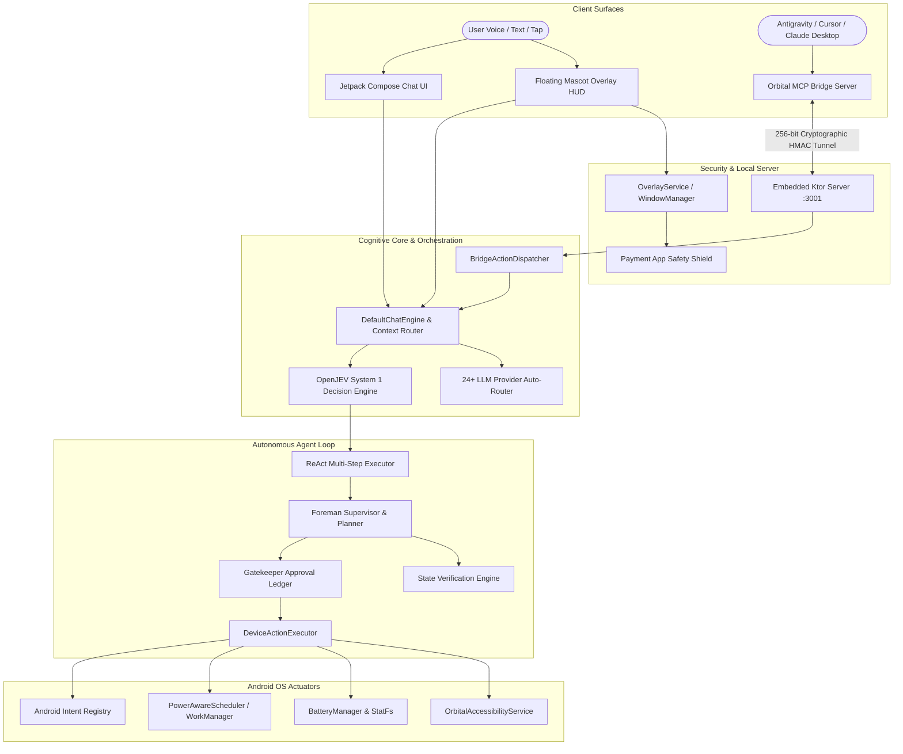

# 🛰️ Orbital — Autonomous Floating AI Companion & MCP Mobile Bridge for Android

<div align="center">

[](https://github.com/jaypal1046/Orbital/releases)
[](https://github.com/jaypal1046/Orbital/actions)
[](https://kotlinlang.org/)
[-green?style=for-the-badge&logo=android)](https://developer.android.com/)
[-blue?style=for-the-badge)](https://modelcontextprotocol.io/)
[](LICENSE)

**Orbital** is an advanced, client-side executive AI companion and Model Context Protocol (MCP) bridge for Android. Operating as an always-on floating mascot on your screen, it executes real on-device actions, orchestrates multi-step mobile workflows, monitors device health, and interfaces directly with developer IDEs (**Antigravity, Cursor, Claude Desktop, VS Code**) for wireless, autonomous mobile control and automated testing.

</div>

---

## 📑 Table of Contents

- [🌟 Comprehensive Feature Matrix](#-comprehensive-feature-matrix)
- [🏗️ Architectural Blueprint](#-architectural-blueprint)
- [📖 How It Works & System Deep-Dive](doc/HOW_IT_WORKS.md)
- [🎭 Mascot Companions & Emotion Engine](#-mascot-companions--emotion-engine)
- [📱 Jetpack Compose Chat & Onboarding Surfaces](#-jetpack-compose-chat--onboarding-surfaces)
- [🤖 On-Device Autonomous ReAct & Foreman Supervisor](#-on-device-autonomous-react--foreman-supervisor)
- [🔌 Model Context Protocol (MCP) Mobile Bridge](#-model-context-protocol-mcp-mobile-bridge)
- [🌌 Modular Mobile Skills Framework](#-modular-mobile-skills-framework)
- [🌐 24+ Multi-Provider LLM Auto-Router](#-24-multi-provider-llm-auto-router)
- [⚡ Power-Aware Automation & Background Worker](#-power-aware-automation--background-worker)
- [🔋 Hardware & Thermal Diagnostics](#-hardware--thermal-diagnostics)
- [🔄 In-App Updates & Dynamic OTA Hot-Patching](#-in-app-updates--dynamic-ota-hot-patching)
- [🛡️ Security, Safety & Zero-Leak Privacy](#-security-safety--zero-leak-privacy)
- [📂 Project Structure](#-project-structure)
- [🚀 Quick Start & Pairing Guide](#-quick-start--pairing-guide)
- [🧪 Testing & Verification Suite](#-testing--verification-suite)
- [🌐 Ecosystem & Documentation](#-ecosystem--documentation)
- [📄 License](#-license)

---

## 🌟 Comprehensive Feature Matrix

| Category | Key Capabilities & Features |
| :--- | :--- |
| **Floating Mascot HUD** | `SYSTEM_ALERT_WINDOW` overlay, edge docking, spring drag physics, multi-state sprite animations, visual connection & microphone indicators. |
| **Chat & UI Surface** | Full Jetpack Compose chat UI, live streaming text, dynamic Markdown rendering, code block styling, setup wizard, character selection, token cost estimator. |
| **Autonomous Brain** | Autonomous Reason $\rightarrow$ Act $\rightarrow$ Verify (`ReActExecutor`), Foreman step-planner, state verification hashing, automatic modal/dialog clearer. |
| **MCP Mobile Bridge** | 13 native MCP tools, embedded Ktor local server (`tcp:3001`), live DOM/accessibility tree parser, high-res screen captures, zero-latency gestures. |
| **LLM Inference Router** | 24+ backends across 4 speed/reasoning tiers (Groq, Gemini 2.0/3.7, Cerebras, OpenRouter, SambaNova, DeepSeek, Ollama, keyless free providers). |
| **Mobile Skills Engine** | Modular skills for System Automation, App Integrations (YouTube, Spotify, Maps, Gmail), Assistant Tools, and Media Controls. |
| **Device Automations** | PowerAwareScheduler via `WorkManager` for charging-only tasks (nightly digests, voice transcription, memory optimization). |
| **Security & Privacy** | Hardware-backed Android Keystore (AES-256 GCM), Banking & UPI payment app safety shield, zero third-party analytics/ads, session key pairing. |
| **Live Updatability** | 1-Second dynamic OTA hot-patching for prompt rules, Google Play in-app updates (`PlayStoreInAppUpdateManager`), GitHub direct updates. |

---

## 🏗️ Architectural Blueprint

Orbital connects the developer's laptop AI reasoning engine directly to the Android OS hardware via a peer-to-peer collaborative link:



---

## 🎭 Mascot Companions & Emotion Engine

Orbital features customizable, interactive companions that visually reflect AI cognition and device status:

- **Aether**: Cosmic traveler with serene particle fields, protective shields, and high-precision analytical demeanor.
- **Lumy**: Gentle, cheerful light spirit with warm glowing micro-animations and intuitive conversational responses.
- **Volo**: Swift wind explorer designed for high-energy productivity, rapid task automation, and instant shortcuts.

### Supported Emotion States & Indicators
- **`IDLE`**: Floating gently with soft breathing bob animations.
- **`THINKING`**: Active thought aura during LLM query resolution.
- **`WORKING`**: Highlighting progress during multi-step on-device automation.
- **`CELEBRATING` / `HAPPY`**: Task completion and positive interaction feedback.
- **`CURIOUS` / `SLEEP`**: Idle exploration and night-time power-saving mode.
- **`LOW_BATTERY`**: Automatic power-conservation state when battery drops below threshold.
- **Real-Time Indicators**: Live color-coded status badges for model connection (`Connected`, `Connecting`, `Error`) and microphone audio levels.

---

## 📱 Jetpack Compose Chat & Onboarding Surfaces

1. **Rich Markdown & Code Composer**: Dynamic typography, syntax-highlighted code snippets, expandable cards, and one-tap clipboard copy.
2. **Context Cost & Token Compactor**: Real-time token usage estimator (`ContextCostEstimator`) and automatic sliding-window transcript compaction (`ContextCompactionEngine`).
3. **Setup Wizard (`SetupWizardActivity`)**: Guided step-by-step onboarding with dynamic permission verification (Accessibility Service, Overlay, Microphone, Notifications).
4. **Character Customization (`CharacterSelectionActivity`)**: Visual character browser with personality previews and instant hot-swapping.
5. **Automation Settings (`AutomationSettingsActivity`)**: Power-aware automation toggles and scheduling intervals.
6. **Laptop AI Bridge (`LaptopBridgeActivity`)**: Seamless QR code scanner and manual IP/port pairing panel.

---

## 🤖 On-Device Autonomous ReAct & Foreman Supervisor

Orbital features a full tactical autonomous agent engine running natively on Android:

- **`ReActExecutor` (Reason $\rightarrow$ Act $\rightarrow$ Verify)**: Autonomous on-device state machine that executes actions, perceives resulting DOM changes, and self-corrects until user goals are achieved.
- **`ForemanSupervisor`**: Breaks multi-step natural language goals into atomic milestones with real-time visual step tracking.
- **`StateVerificationEngine`**: Performs DOM hierarchy hashing and post-action assertions to confirm that buttons clicked or texts entered achieved the desired UI state.
- **`ObstacleClearanceEngine`**: Automatically detects and dismisses transient system dialogs, rate-limit prompts, and notification permission popups.
- **`Gatekeeper Approval Modes`**:
  - `ALWAYS_PROCEED`: Executes all system and app actions immediately.
  - `REQUEST_FOR_ACTION`: Displays interactive confirmation cards before sensitive actions (calls, settings modifications, transactions).
  - `AUTO_SAFE`: Automatically proceeds with safe queries while requiring explicit confirmation for mutating actions.

---

## 🔌 Model Context Protocol (MCP) Mobile Bridge

Orbital exposes 13 native MCP tools for developer IDEs (**Antigravity, Cursor, Claude Desktop, Windsurf, VS Code**):

> [!TIP]
> **Zero-Install Quick Start**: Run `npx -y orbital-mcp` to launch the bridge host immediately!

| # | MCP Tool | Input Parameters | Purpose |
| :--- | :--- | :--- | :--- |
| 1 | `inspect_phone_screen` | _None_ | Captures structured accessibility hierarchy nodes, bounding boxes, text labels, and clickability states. |
| 2 | `tap_phone_element` | `targetText`, `targetId` | Taps interactive UI elements matching exact text or resource ID. |
| 3 | `tap_phone_coordinates` | `x`, `y` | Taps exact pixel coordinates on the phone screen. |
| 4 | `type_phone_text` | `text`, `targetLabel` | Enters text into focused or targeted input fields. |
| 5 | `open_phone_app` | `packageName` | Dynamically resolves and launches installed apps by name or package ID. |
| 6 | `swipe_phone_screen` | `direction`, `startX/Y`, `endX/Y` | Scrolls or gestures across the screen in any direction or custom vector. |
| 7 | `press_phone_key` | `key` (`BACK`, `HOME`, `RECENTS`, etc.) | Triggers global Android navigation and hardware keys. |
| 8 | `execute_device_action` | `action`, `target`, `query`, `enabled` | Controls system toggles (`FLASHLIGHT`, `DEVICE_STATUS`, `SET_SOUND_MODE`, `OPEN_SETTING`, `SET_TIMER`, `SEARCH_WEB`). |
| 9 | `assert_screen_contains` | `expectedText` | Asserts that specific text or element exists on the screen for test validation. |
| 10 | `ask_phone_ai` | `prompt`, `sessionTitle` | Delegates natural language goals to the on-device Orbital AI companion. |
| 11 | `execute_phone_task_batch` | `planTitle`, `steps[]`, `stopOnError` | Executes multi-step batch interaction plans in a single round-trip with telemetry. |
| 12 | `manage_phone_session` | `command`, `sessionId`, `title` | Manages persistent on-device Room-backed chat and execution sessions. |
| 13 | `explore_and_analyze_app` | `appName` | Autonomously explores any app, analyzes spatial layout, and generates UX/product reports. |

---

## 🌌 Modular Mobile Skills Framework

```
Mobile Skills Registry
├── ⚙️ System Automation: Flashlight, Volume, Wi-Fi, Bluetooth, Screen Brightness, Sound Modes
├── 🛠️ Assistant Tools: Timers, Alarms, Calendar Reminders, Device Diagnostics, System Settings
├── 📱 App Integrations: Deep linking and content search in YouTube, Spotify, Maps, Gmail, Messaging
└── 🎵 Media Controller: Streams songs, artists, playlists, and controls audio across media providers
```

---

## 🌐 24+ Multi-Provider LLM Auto-Router

Orbital supports direct integration with 24+ leading LLM inference backends with automatic failover and streaming token support:

| Tier | Providers | Characteristics |
| :--- | :--- | :--- |
| **Ultra-Fast Speed** | **Groq**, **Cerebras**, **SambaNova** | Sub-300ms time-to-first-token, Llama 3.3 70B, Qwen 2.5 Coder |
| **Frontier Reasoning** | **Google Gemini (2.0/3.7)**, **OpenRouter**, **DeepSeek R1** | Multi-step reasoning, tool assembly, massive context windows |
| **Keyless / Open** | **Pollinations**, **Kilo**, **OVH**, **AI Horde** | Instant access with zero configuration or API keys required |
| **Self-Hosted / Local** | **Ollama**, **Embedded Ktor Server (:3001)** | 100% private, on-device or local network inference |

---

## ⚡ Power-Aware Automation & Background Worker

Using Android's `WorkManager` framework, `PowerAwareScheduler` orchestrates heavy background tasks when device conditions are optimal:

- **Battery & Charging Gating**: Executes compute-heavy tasks only when connected to power and battery $> 80\%$.
- **Nightly Digest Generation**: Synthesizes daily notifications and activity summaries between 2:00 AM – 5:00 AM.
- **Voice Memo Transcription**: Queues and batches audio speech-to-text processing when device is plugged in.
- **Automated Memory Compaction**: Periodically compacts SQLite transcript logs and purges expired temporary caches.

---

## 🔋 Hardware & Thermal Diagnostics

- **Battery Health**: Real-time capacity from `BatteryManager.BATTERY_PROPERTY_CAPACITY` and sticky battery intent broadcasts.
- **Thermal Sensors**: Real-time battery and CPU thermal diagnostics in Celsius (°C).
- **Storage Metrics**: Internal storage capacity calculations via `android.os.StatFs`.
- **System Telemetry**: Device model (`Build.MODEL`), manufacturer, Android OS version, and network connectivity state.

---

## 🔄 In-App Updates & Dynamic OTA Hot-Patching

- **1-Second OTA Hot-Patching (`DynamicOtaConfigStore`)**: Dynamically updates system prompt rules, default model routes, and enabled skill tiers from a remote JSON manifest without needing an APK update.
- **Google Play In-App Updates (`PlayStoreInAppUpdateManager`)**: Flexible and Immediate in-app update flows via the official Play Core API.
- **GitHub Direct Releases (`GitHubUpdateManager`)**: Automatic update checker and background APK installer for standalone builds.

---

## 🛡️ Security, Safety & Zero-Leak Privacy

```
┌─────────────────────────────────────────────────────────────────────────┐
│                        DATA PRIVACY GUARANTEE                           │
├────────────────────────────────┬────────────────────────────────────────┤
│ Local Storage                  │ 100% on-device AES-256 GCM encrypted   │
│ Analytics / Trackers           │ 0 third-party analytics or ads SDKs    │
│ Voice & Audio                  │ Processed ephemerally in real-time     │
│ Remote Data Harvesting         │ No telemetry collection / selling data │
│ IDE Bridge Authentication      │ Cryptographic session key handshake    │
└────────────────────────────────┴────────────────────────────────────────┘
```

- **Strict Payment Shield (`PaymentAppShield`)**: Background monitor detects banking, UPI, and financial apps (Google Pay, PhonePe, Paytm, BHIM, banking apps) and immediately conceals the floating overlay.
- **Hardware-Backed Keystore**: All credentials, tokens, and API keys are stored in `EncryptedSharedPreferences` backed by the Android Keystore.
- **HMAC-SHA256 Signatures**: Remote MCP commands are verified using cryptographic signatures to prevent unauthorized execution.
- **Strict Zero-Hardcoding Rule**: All dynamic app resolutions, queries, and execution paths are computed strictly from live runtime system states.

---

## 📂 Project Structure

```
Orbital/
├── .github/workflows/           # CI/CD workflows for compilation, testing & release
├── app/src/main/java/com/orbital/
│   ├── action/                  # DeviceActionExecutor, ActionParser, ActionRegistry
│   ├── automation/              # OrbitalAccessibilityService, Screen Hierarchy Parser
│   ├── bridge/                  # OrbitalBridgeClient, BridgeActionDispatcher, CryptoAuth
│   ├── chat/                    # DefaultChatEngine, StreamingClient, Multi-Router
│   ├── data/                    # SecureStorage, SQLite Room Database, LLM Repository
│   ├── decision/jev/            # OpenJEV Fast Decision Heuristic Engine
│   ├── foreman/                 # ForemanSupervisor, ExecutionTracker, Step Planning
│   ├── memory/                  # HindsightMemoryEngine, App Quirks Ledger
│   ├── overlay/                 # OverlayService (WindowManager), Mascot Sprites, Physics
│   ├── power/                   # PowerAwareScheduler, WorkManager Automations
│   ├── safety/                  # PaymentAppShield, TamperDetector
│   ├── skills/                  # MobileSkillRegistry, Modular AI Skills
│   ├── ui/                      # Jetpack Compose UI (Chat, Setup Wizard, Character Picker)
│   └── updater/                 # Dynamic OTA Config, Play Store & GitHub Updaters
├── doc/                         # Comprehensive Architecture Guides & Play Store Assets
│   ├── HOW_IT_WORKS.md          # In-depth operational and architectural guide
│   ├── playstore_assets/        # Official graphics, 512x512 icons, screenshots 1-8
│   └── privacy/                 # Privacy Policy, Terms, and Vercel web deployment
├── tests/                       # Autonomous app exploration & MCP validation suites
└── tools/orbital-mcp/           # Standalone Node.js Model Context Protocol Server
```

---

## 🚀 Quick Start & Pairing Guide

### 1. Install the Android App
Download the signed APK from [Releases](https://github.com/jaypal1046/Orbital/releases) or build from source:
```bash
./gradlew assembleDebug
adb install -r app/build/outputs/apk/debug/app-debug.apk
```

### 2. Configure MCP Server in Your IDE
Add Orbital to your IDE's MCP configuration (`mcp_config.json` or `claude_desktop_config.json`):
```json
{
  "mcpServers": {
    "orbital-phone": {
      "command": "node",
      "args": ["c:/Jay/dev/Orbital/tools/orbital-mcp/index.js"]
    }
  }
}
```

### 3. Pair Device
1. Open Orbital and grant requested permissions in the **Setup Wizard**.
2. Navigate to **🛰️ Laptop AI Bridge** and scan the pairing QR code or connect over ADB port forward:
   ```bash
   adb forward tcp:3001 tcp:3001
   ```
3. Your IDE agent can now directly inspect, control, and test your Android device wirelessly!

---

## 🧪 Testing & Verification Suite

Run the full Android unit test suite:
```bash
./gradlew testDebugUnitTest
```

Build signed release bundles:
```bash
./gradlew bundleRelease assembleRelease
```

---

## 🌐 Ecosystem & Documentation

- **📖 [How Orbital Works Guide](doc/HOW_IT_WORKS.md)**: Deep architectural breakdown of overlay physics, zero-latency accessibility parser, and MCP tool execution engine.
- **🔒 [Privacy & Legal Architecture](doc/privacy/README.md)**: Technical overview of on-device AES-256 GCM encrypted storage, zero telemetry tracking, and hardware-backed credential isolation.
- **🛰️ [Dedicated MCP Server](https://github.com/jaypal1046/orbital_mcp)**: Standalone MCP bridge repository for developers who only need the desktop MCP tool host.
- **🔒 [Hosted Privacy Policy & Terms](https://jaypal1046.github.io/orbital_policy/)**: Public legal compliance and terms of service.

---

## 📄 License

This project is licensed under the **MIT License** — see the [LICENSE](LICENSE) file for details.

<div align="center">
Built with ❤️ for intelligent, autonomous, and secure mobile AI interaction.
</div>