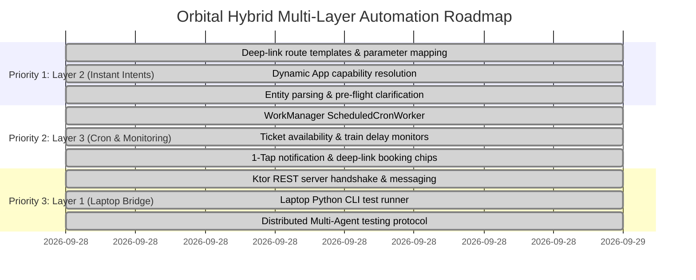

# 🚀 Orbital Hybrid Multi-Layer Automation Engine: Architecture & Implementation Plan

## 📌 Executive Summary
This document establishes the architectural blueprint and phased implementation strategy for the **Orbital Multi-Layer Autonomous Engine**. The system enables the on-device AI companion to dynamically choose between **Instant Deep-Link/Intent Execution** (Layer 2), **Autonomous Background Cron Jobs & Ticket Alerts** (Layer 3), and a **Distributed Laptop-to-Phone Agent Bridge** (Layer 1).

---

## 🎯 Layer Priority Roadmap

```
┌─────────────────────────────────────────────────────────────────────────────────────────────┐
│                              PRIORITY EXECUTION MATRIX                                      │
├──────────────────────────┬─────────────────────────────────────────────────┬────────────────┤
│ Implementation Priority  │ Component / Layer                               │ Primary Target │
├──────────────────────────┼─────────────────────────────────────────────────┼────────────────┤
│ 🔥 PRIORITY 1            │ LAYER 2: Instant Dynamic Intent & Deep-Linking  │ On-Device (AI) │
│ 🔥 PRIORITY 2            │ LAYER 3: Background Cron & Monitoring Engine    │ On-Device (AI) │
│ ⏳ PRIORITY 3 (Later)    │ LAYER 1: Distributed Laptop-to-Mobile Agent     │ PC ⟷ Phone     │
└──────────────────────────┴─────────────────────────────────────────────────┴────────────────┘
```

---

## 🏗️ Detailed Architecture by Layer

```
                                    ┌───────────────────────────────┐
                                    │     User Prompt / Intent      │
                                    └───────────────┬───────────────┘
                                                    │
                                                    ▼
                                    ┌───────────────────────────────┐
                                    │    On-Device AI Classifier    │
                                    └───────────────┬───────────────┘
                                                    │
                   ┌────────────────────────────────┴────────────────────────────────┐
                   ▼                                                                 ▼
      [Immediate / Direct Action]                                       [Time-Based / Recurring / Alert]
                   │                                                                 │
                   ▼                                                                 ▼
     ┌──────────────────────────────┐                                  ┌──────────────────────────────┐
     │ ⚡ LAYER 2: INTENT ROUTER     │                                  │ ⏰ LAYER 3: CRON MONITOR      │
     ├──────────────────────────────┤                                  ├──────────────────────────────┤
     │ • Deep-Link URL Templates    │                                  │ • Android WorkManager Crons  │
     │ • Native Intent Categories   │                                  │ • PowerAwareScheduler        │
     │ • Zero-Delay Execution (0ms) │                                  │ • Live Ticket/Train Alerts   │
     │ • Pre-filled Parameter Map   │                                  │ • 1-Tap Booking Notification │
     └──────────────────────────────┘                                  └──────────────────────────────┘
                                                    │
                                                    │ (Later Stage Bridge)
                                                    ▼
                                    ┌───────────────────────────────┐
                                    │ 💻 LAYER 1: LAPTOP AGENT      │
                                    ├───────────────────────────────┤
                                    │ • Embedded Ktor Server (:3001)│
                                    │ • ADB UIAutomator Controller  │
                                    │ • PC ⟷ Phone Multi-Agent      │
                                    │ • QA Testing & Screen Dump    │
                                    └───────────────────────────────┘
```

---

# 🔄 The Closed-Loop Page-State & Next-Action Planning Engine

### 1. The Core Challenge
In real-world mobile automation (e.g. *booking train/movie tickets, ordering food, checking live statuses*), tasks span **multiple sequential screens**:
1. **Screen 1 (Search / Input Form)**: Stations, dates, filters.
2. **Screen 2 (Results / List View)**: Available trains, seat quotas, prices.
3. **Screen 3 (Details / Selection View)**: Specific coach, berth, or time slot.
4. **Screen 4 (Checkout / Confirmation)**: Passenger inputs, payment summary.

If the AI only executes a single blind action, it cannot know:
- **What page loaded next?**
- **Were there multiple trains/options to choose from?**
- **Did an error/dialog appear (e.g., 'No trains found' or 'Login required')?**

To solve this, the **Page-State Observer Engine** converts every screen transition into structured feedback that is immediately fed back into the AI's context.

---

### 2. The Page State & Next-Action Data Contract

```kotlin
/**
 * Structured state returned after every action execution,
 * allowing the AI to understand the current page and decide the next step.
 */
data class PageObservation(
    val appPackage: String,
    val pageIdentity: String,          // e.g. "WhereIsMyTrain.TrainListScreen", "BookMyShow.SeatLayout"
    val pageType: PageType,            // FORM, LIST_VIEW, DETAILS_VIEW, CHECKOUT, DIALOG, ERROR
    val visibleInputs: List<InputFieldState>, // Text inputs with current values
    val visibleButtons: List<String>,  // Available CTAs: ["Find trains", "Tatkal", "Book 3A"]
    val extractedEntities: Map<String, String>, // e.g. {"train_1": "12951 Rajdhani", "delay": "10m"}
    val possibleNextActions: List<DeviceAction>, // AI recommended next steps
    val requiresUserClarification: Boolean = false
)
```

---

### 3. Step-by-Step Autonomous Journey Example

```
User: "Check Where is my train from Mumbai to Bhadohi and show me live delay"
                          │
                          ▼
┌──────────────────────────────────────────────────────────────────┐
│ STEP 1: INITIAL PAGE OBSERVE & DISPATCH                          │
│ • State: HomeScreen (Inputs: From="Mumbai LTT", To="Bhadohi")    │
│ • Action Dispatched: CLICK_ELEMENT("Find trains")                │
└─────────────────────────────────┬────────────────────────────────┘
                                  │
                                  ▼
┌──────────────────────────────────────────────────────────────────┐
│ STEP 2: NEXT-PAGE STATE CAPTURE & AI CONTEXT FEEDBACK            │
│ • State Captured: TrainListScreen                                │
│ • Extracted Trains:                                              │
│   1. 11072 Kamayani Exp (Dep: 12:10, Arr: 15:30)                │
│   2. 04140 Prayagraj Spl (Dep: 14:00, Arr: 17:45)               │
│ • AI Receives Full Page State in Chat Memory                     │
└─────────────────────────────────┬────────────────────────────────┘
                                  │
                                  ▼
┌──────────────────────────────────────────────────────────────────┐
│ STEP 3: NEXT-ACTION PLANNING & RESULT SUMMARY                    │
│ • AI generates concise train summary card in Orbital chat        │
│ • AI presents contextual 1-tap chips:                            │
│   [Live Status 11072] [Live Status 04140] [Set Booking Reminder] │
└──────────────────────────────────────────────────────────────────┘
```

---

### 4. How Each Layer Integrates with Page-State Feedback

1. **Layer 2 (Intent & Deep-Link Protocol)**:
   - Passes exact parameters into the initial deep-link URI.
   - When the destination page opens, Page-State Observer extracts the rendered list/results and informs the AI.
2. **Layer 3 (Background Cron & Monitoring WorkManager)**:
   - Periodic cron worker evaluates page state (e.g. checks if seat count > 0).
   - If condition matches, notifies the user with the exact train/seat details and a 1-tap direct checkout trigger.
3. **Layer 1 (Laptop-to-Mobile Agent Bridge)**:
   - Dumps full XML and accessibility tree across pages for end-to-end multi-page testing suites.

---

# ⚡ Phase 1 (Priority 1): Layer 2 — Instant Intent & Deep-Link Protocol

### 1. Goal
Execute immediate user commands instantaneously (0ms delay) by pre-filling parameters directly into destination apps (*Where is My Train*, *Google Maps*, *Spotify*, *Gmail*, *WhatsApp*, *Zomato*, etc.) without requiring screen accessibility permissions or manual taps.

### 2. Implementation Components
* **`DeepLinkLedger.kt`**: Maps apps to standard URI schemes and parameter templates:
  ```kotlin
  data class DeepLinkRoute(
      val appName: String,
      val packageName: String,
      val uriTemplate: String, // e.g., "whereismytrain://search?from={from}&to={to}&train={train}"
      val fallbackWebUrl: String,
      val requiredParams: List<String>,
      val category: AppCategory
  )
  ```
* **Dynamic Parameter Extractor**:
  - Automatically parses entities (`source`, `destination`, `train_number`, `song`, `recipient`, `query`).
  - Formats URL-encoded intent queries.
* **Fallback Chain**:
  1. Direct App Deep Link (`Intent.ACTION_VIEW` with custom URI).
  2. Generic Android Intent (`Intent.ACTION_SEARCH`, `MediaStore.INTENT_ACTION_MEDIA_PLAY_FROM_SEARCH`).
  3. Direct Web Browser fallback with parameters preserved.

### 3. Deliverables & Validation
- [x] De-hardcode package lists into `AppCapabilityManager`.
- [x] Dynamic category intent resolution in `DeviceActionExecutor`.
- [x] Unit test validation for parameter injection.

---

# ⏰ Phase 2 (Priority 2): Layer 3 — Background Cron & Monitoring WorkManager Engine

### 1. Goal
Empower Orbital to continuously monitor ticket availability, live train running delays, price drops, or scheduled tasks in the background without user intervention, firing high-priority alerts with 1-tap direct action triggers.

### 2. Implementation Components
* **`ScheduledCronWorker.kt` (Android WorkManager ListenableWorker)**:
  - Executes periodic background evaluations (e.g. every 15m, 30m, 1h, or daily at specified times).
  - Power-aware constraints: Checks battery status, Wi-Fi availability, and charging state via `PowerAwareScheduler`.
* **Cron Task Registry (`CronTaskLedger.kt`)**:
  ```kotlin
  data class CronTask(
      val id: String,
      val taskType: String, // TRAIN_MONITOR, TICKET_ALERT, DAILY_BRIEFING, REMINDER
      val query: String,
      val intervalMinutes: Long,
      val scheduledTimeMillis: Long?,
      val targetCondition: String? // e.g., "SEATS_AVAILABLE", "DELAY_EXCEEDS_15M"
  )
  ```
* **Interactive 1-Tap Notification & Chat Card**:
  - When the condition is met, Android Notification Manager displays:
    - Title: *"🎟️ Tickets Open for Train 12951!"*
    - Body: *"Seats are now available from Mumbai to Delhi. Tap below to book instantly."*
    - Action Chip: Launches Layer 2 Deep-Link directly to the checkout page.

### 3. Deliverables & Validation
- [x] Background scheduling via `WorkManager` in `PowerAwareScheduler.kt`.
- [x] Automated notification channels and 1-tap PendingIntent triggers.
- [x] Integration with `ActionParser` to handle prompts like *"Check train status every day at 8 AM"*.

---

# 💻 Phase 3 (Priority 3 - Later Stage): Layer 1 — Distributed Laptop-to-Phone Multi-Agent Bridge

### 1. Goal
Allow developers and QA engineers to connect Laptop AI agents to the Phone AI companion over USB/Wi-Fi for automated mobile testing, screen inspection, and end-to-end user journey verification without accessibility permissions.

### 2. Implementation Components
* **Embedded Ktor REST Server (`OverlayService.kt`) on Port 3001**:
  - `GET /api/agent/handshake`: Exposes companion character, status, and capabilities.
  - `POST /api/agent/message`: Injects prompts from Laptop AI directly into the on-device companion.
  - `POST /api/action/execute`: Remotely triggers actions on phone.
  - `GET /api/screen/snapshot`: Returns UI hierarchy and elements.
* **Laptop Python Automation CLI (`tools/orbital_agent.py`)**:
  - ADB UIAutomator dump + Touch simulator.
  - Coordinates multi-step UI testing workflows.

---

## 🛠️ Step-by-Step Execution Plan & Live Verification Status



---

## 🔒 Compliance & Reliability Guarantees
1. **100% Google Play Store Compliant**: Layer 2 and Layer 3 operate strictly through native Android Intents, Deep Links, and WorkManager APIs without requiring special Accessibility declarations.
2. **Zero Battery Drain**: Background cron tasks obey Android Doze mode and power constraints (only executing when connected to network).
3. **No Hardcoded Package Names**: Dynamic discovery via `AppCapabilityManager` ensures seamless compatibility across Samsung, Pixel, Xiaomi, OnePlus, and other Android OEMs.
4. **Self-Healing LLM Auto-Router**: Seamless failover across 24+ free & direct LLM providers with automatic 400/429/503 fallback and key synchronization.

