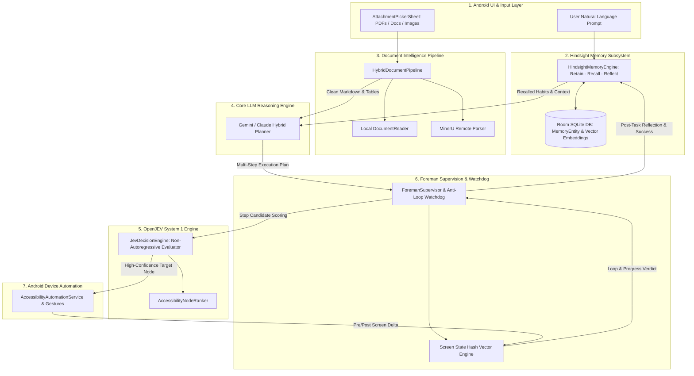
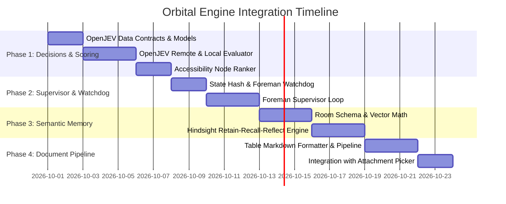

# Master Architecture & Technical Integration Blueprint for Orbital

## 1. System Topology & Unified Dataflow

---

## 2. Comprehensive Repository Decision Rationale

| Repository | Focus | Verdict | Justification & Architectural Role |
| :--- | :--- | :--- | :--- |
| **[`razorback16/openjev`](https://github.com/razorback16/openjev)** | Fast "System 1" Decision Engine | **ADOPT (Core)** | Replaces slow full-LLM text generations with sub-100ms non-autoregressive logit scoring for live UI node selection and post-tap verification. |
| **[`thruwire/foreman`](https://github.com/thruwire/foreman)** | Deterministic Agent Supervisor | **ADOPT (Core)** | Prevents loops, deadlocks, and repetitive gestures; calculates screen state hashes and provides deterministic recovery steering directives. |
| **[`vectorize-io/hindsight`](https://github.com/vectorize-io/hindsight)** | Semantic Long-term Memory | **ADOPT (Core)** | Implements a 4-way hybrid retrieval model (Vector, Keyword, Graph, Temporal) for habit learning and app quirk recall with zero hardcoding. |
| **[`opendatalab/MinerU`](https://github.com/opendatalab/MinerU)** | Complex Document Parsing | **ADOPT (Hybrid)** | Upgrades `DocumentReader.kt` and `AttachmentPickerSheet.kt` to extract structured Markdown tables from multi-column PDFs. |
| **[`hydra-db/open-glean`](https://github.com/hydra-db/open-glean)** | Enterprise Workplace Search | **SKIP** | Built for corporate multi-user SaaS (Notion, Slack, Jira); too heavyweight for on-device personal assistant. |
| **[`mvschwarz/openrig`](https://github.com/mvschwarz/openrig)** | CLI/tmux Multi-agent Swarm | **SKIP** | Geared towards terminal-based coding agents in tmux sessions; redundant with Foreman. |
| **[`MxCorpIn/Repolyze`](https://github.com/MxCorpIn/Repolyze)** | Git Contributor Analytics | **NOT NEEDED** | Out of scope (developer Git commit heatmaps). |
| **[`debpalash/VoiceStudio`](https://github.com/debpalash/VoiceStudio)** | Local TTS / STT Studio | **DEFERRED** | Preserved for upcoming dedicated voice interaction milestone. |

---

## 3. Dedicated Plan Index & File Links

1. ⚡ **[PLAN_OPENJEV_DECISION_ENGINE.md](file:///c:/Jay/dev/Orbital/doc/PLAN_OPENJEV_DECISION_ENGINE.md)**
   * Mathematical logit formulas ($P(Yes)$, Softmax candidate distributions).
   * Complete Kotlin classes (`BooleanDecision`, `ChoiceDecision<T>`, `JevRemoteClient`, `AccessibilityNodeRanker`).
   * Dynamic, zero-hardcoded UI node ranking from `AccessibilityNodeInfo`.

2. 🛡️ **[PLAN_FOREMAN_SUPERVISOR.md](file:///c:/Jay/dev/Orbital/doc/PLAN_FOREMAN_SUPERVISOR.md)**
   * State hash algorithm $\mathcal{H}(S_t)$ over visible accessibility nodes.
   * Watchdog stall ($N=2$) and 2-state oscillation ($A \rightarrow B \rightarrow A \rightarrow B$) detectors.
   * Complete Kotlin state machine (`SteeringDirective`, `ForemanWatchdog`, `ForemanSupervisor`).

3. 🧠 **[PLAN_HINDSIGHT_AGENT_MEMORY.md](file:///c:/Jay/dev/Orbital/doc/PLAN_HINDSIGHT_AGENT_MEMORY.md)**
   * 4-way hybrid scoring equation ($S_{hybrid} = w_v \cdot \text{Sim}_v + w_k \cdot \text{BM25} + w_t \cdot e^{-\lambda \Delta t} + w_r \cdot \text{Conf}$).
   * Full Room schema (`MemoryEntity`, `HindsightDao`, vector cosine calculation).
   * Pre-turn habit injection and post-turn reflection into `ChatViewModel.kt`.

4. 📄 **[PLAN_MINERU_DEEP_PARSER.md](file:///c:/Jay/dev/Orbital/doc/PLAN_MINERU_DEEP_PARSER.md)**
   * Document layout segmentation and reading order reconstructor.
   * Table-to-Markdown matrix generator (`TableMarkdownFormatter`).
   * Hybrid routing between local Android PDF reader and deep remote parser.

---

## 4. Phased Implementation Sequence

