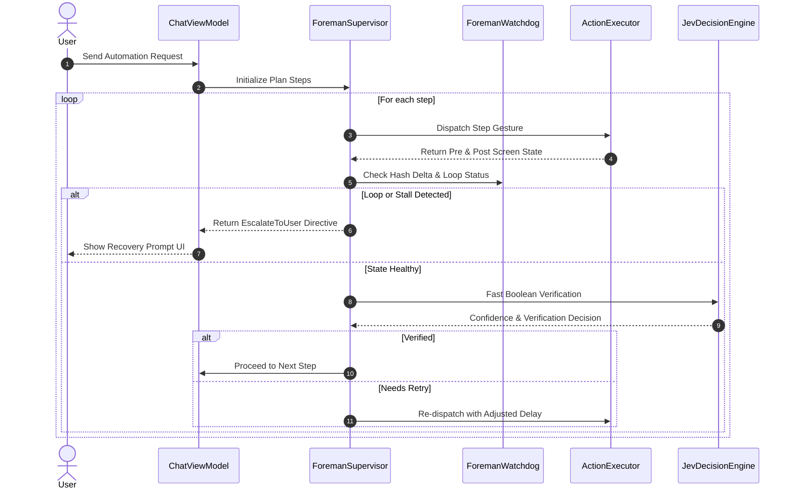

# Deep Technical Plan: Foreman Agent Supervisor & Anti-Loop Engine (Kotlin Native)

## 1. Executive Summary & Source Analysis
- **Source Repository**: [`thruwire/foreman`](https://github.com/thruwire/foreman) (Deterministic Agent Supervisor & Software Factory Overseer).
- **Core Mechanism**: A supervisory state machine and watchdog loop that operates above the autonomous action dispatcher. It continuously calculates screen hash deltas, evaluates execution progress, detects cyclic deadlocks (e.g. clicking an unresponsive button or endless modal loops), and issues deterministic steering directives (`Proceed`, `Retry`, `Backtrack`, `Escalate`).
- **Orbital Problem Solved**:
  1. Preventing agent execution freezes and infinite loops on Android devices.
  2. Enforcing safety bounds on action sequences.
  3. Verifying post-gesture state changes deterministically using OpenJEV before dispatching the next step.

---

## 2. Mathematical & Algorithmic Formulations

### 2.1 Screen State Hash Vector ($S_t$)
To detect loops without saving full bitmaps or large XML trees, Foreman computes a lightweight state footprint:

$$\mathcal{H}(S_t) = \text{MD5}\Big(\text{pkg}(S_t) \parallel \text{activity}(S_t) \parallel \sum_{n \in \text{VisibleNodes}} \text{CRC32}(n.id + n.text + n.bounds)\Big)$$

### 2.2 Loop & Oscillation Detection Window
Given a rolling history of past state hashes $W_k = [h_{t-k}, \dots, h_t]$:
- **Stall Condition**: $h_t == h_{t-1} == h_{t-2}$ (State did not change despite action).
- **Oscillation Condition**: $h_t == h_{t-2} \text{ and } h_{t-1} == h_{t-3}$ (Agent is bouncing between two screens/dialogs).
- **Max Retry Threshold**: Total retries on equivalent sub-goals $\ge N_{max}$ (default 3).

---

## 3. Kotlin Architecture (`com.orbital.foreman`)

```
app/src/main/java/com/orbital/foreman/
├── ForemanSupervisor.kt        # Master supervisor orchestration loop
├── ForemanWatchdog.kt          # State hash tracking, stall & oscillation detector
├── ForemanStateContracts.kt     # States, lifecycle events, and steering directives
├── PlanExecutionTracker.kt     # Dynamic multi-step plan state and progress metrics
└── SupervisorInterceptor.kt     # Coroutine interceptor for UI gestures & tool calls
```

---

## 4. Complete Kotlin Implementation Blueprint

### 4.1 State Contracts (`ForemanStateContracts.kt`)

```kotlin
package com.orbital.foreman

enum class StepStatus {
    NOT_STARTED,
    RUNNING,
    VERIFYING,
    SUCCEEDED,
    FAILED,
    SKIPPED
}

data class ExecutionStep(
    val id: String,
    val description: String,
    val targetPackage: String?,
    val expectedOutcome: String,
    val status: StepStatus = StepStatus.NOT_STARTED,
    val retryCount: Int = 0,
    val maxRetries: Int = 3
)

sealed interface SteeringDirective {
    /** Step succeeded and achieved goal; move to subsequent step. */
    object ProceedToNext : SteeringDirective

    /** Step did not apply cleanly; retry with adjusted delay or coordinate offsets. */
    data class RetryCurrent(
        val attemptNumber: Int,
        val suggestedAdjustment: String
    ) : SteeringDirective

    /** Action failed or is blocked; branch into alternative plan. */
    data class ExecuteFallback(
        val fallbackReason: String,
        val fallbackStep: ExecutionStep
    ) : SteeringDirective

    /** Loop/Deadlock detected or human confirmation required. */
    data class EscalateToUser(
        val issueSummary: String,
        val resolutionPrompt: String
    ) : SteeringDirective

    /** Complete task failure; clean up and abort. */
    data class AbortExecution(val criticalReason: String) : SteeringDirective
}
```

### 4.2 Anti-Loop Watchdog (`ForemanWatchdog.kt`)

```kotlin
package com.orbital.foreman

import java.security.MessageDigest

class ForemanWatchdog(
    private val windowCapacity: Int = 10,
    private val maxConsecutiveStalls: Int = 2,
    private val maxOscillations: Int = 2
) {
    private val hashHistory = ArrayDeque<String>(windowCapacity)
    private val actionHistory = ArrayDeque<String>(windowCapacity)

    @Synchronized
    fun computeScreenStateHash(
        packageName: String,
        activityName: String,
        nodeSignatures: List<String>
    ): String {
        val md = MessageDigest.getInstance("MD5")
        md.update(packageName.toByteArray())
        md.update(activityName.toByteArray())
        for (sig in nodeSignatures) {
            md.update(sig.toByteArray())
        }
        return md.digest().joinToString("") { "%02x".format(it) }
    }

    @Synchronized
    fun recordAndCheckDeadlock(stateHash: String, actionName: String): DeadlockVerdict {
        hashHistory.addLast(stateHash)
        actionHistory.addLast(actionName)
        if (hashHistory.size > windowCapacity) {
            hashHistory.removeFirst()
            actionHistory.removeFirst()
        }

        // 1. Check for consecutive stalls (state unchanged after action)
        if (hashHistory.size >= maxConsecutiveStalls + 1) {
            val recent = hashHistory.takeLast(maxConsecutiveStalls + 1)
            if (recent.all { it == stateHash }) {
                return DeadlockVerdict.Stalled(consecutiveCount = maxConsecutiveStalls + 1)
            }
        }

        // 2. Check for 2-state oscillation (A -> B -> A -> B)
        if (hashHistory.size >= 4) {
            val h = hashHistory.toList()
            val n = h.size
            if (h[n - 1] == h[n - 3] && h[n - 2] == h[n - 4] && h[n - 1] != h[n - 2]) {
                return DeadlockVerdict.Oscillating(cyclePattern = listOf(h[n - 2], h[n - 1]))
            }
        }

        return DeadlockVerdict.Healthy
    }

    @Synchronized
    fun reset() {
        hashHistory.clear()
        actionHistory.clear()
    }
}

sealed interface DeadlockVerdict {
    object Healthy : DeadlockVerdict
    data class Stalled(val consecutiveCount: Int) : DeadlockVerdict
    data class Oscillating(val cyclePattern: List<String>) : DeadlockVerdict
}
```

### 4.3 Master Supervisor Engine (`ForemanSupervisor.kt`)

```kotlin
package com.orbital.foreman

import com.orbital.decision.jev.JevDecisionEngine

class ForemanSupervisor(
    private val jevEngine: JevDecisionEngine,
    private val watchdog: ForemanWatchdog = ForemanWatchdog()
) {
    suspend fun evaluatePostStepState(
        step: ExecutionStep,
        preActionStateHash: String,
        postActionStateHash: String,
        screenContextSummary: String,
        actionExecuted: String
    ): SteeringDirective {
        // 1. Check watchdog for loops
        val deadlock = watchdog.recordAndCheckDeadlock(postActionStateHash, actionExecuted)
        when (deadlock) {
            is DeadlockVerdict.Stalled -> {
                return if (step.retryCount < step.maxRetries) {
                    SteeringDirective.RetryCurrent(
                        attemptNumber = step.retryCount + 1,
                        suggestedAdjustment = "Previous gesture did not alter screen state. Retrying with increased click duration."
                    )
                } else {
                    SteeringDirective.EscalateToUser(
                        issueSummary = "Screen is unresponsive after ${step.maxRetries} attempts on action: $actionExecuted",
                        resolutionPrompt = "Would you like me to skip this step, take over manually, or try an alternative?"
                    )
                }
            }
            is DeadlockVerdict.Oscillating -> {
                return SteeringDirective.EscalateToUser(
                    issueSummary = "Detected navigation loop between alternating screens.",
                    resolutionPrompt = "The app returned to the previous screen. Please guide or perform the step manually."
                )
            }
            DeadlockVerdict.Healthy -> { /* Proceed to semantic check */ }
        }

        // 2. Fast System 1 Verification using OpenJEV
        val verification = jevEngine.decideBinary(
            context = "Action Executed: $actionExecuted\nTarget Goal: ${step.expectedOutcome}\nLive Screen Summary: $screenContextSummary",
            question = "Did this action achieve the expected outcome?",
            confidenceThreshold = 0.65f
        )

        return if (verification.value && verification.confidence >= 0.65f) {
            SteeringDirective.ProceedToNext
        } else if (step.retryCount < step.maxRetries) {
            SteeringDirective.RetryCurrent(
                attemptNumber = step.retryCount + 1,
                suggestedAdjustment = "Outcome not verified with high confidence (${verification.confidence})."
            )
        } else {
            SteeringDirective.EscalateToUser(
                issueSummary = "Could not verify success of step: ${step.description}",
                resolutionPrompt = "Screen state shows: $screenContextSummary. Should I mark as complete and continue?"
            )
        }
    }

    fun resetSession() {
        watchdog.reset()
    }
}
```

---

## 5. Integration Lifecycle with Orbital Action Dispatcher


