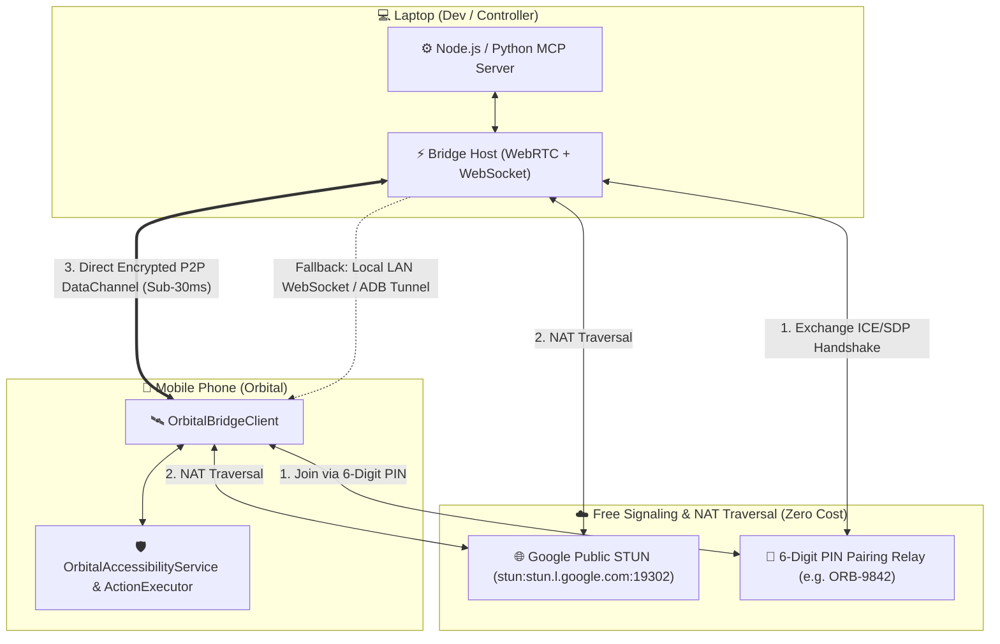

# Architecture & Implementation Plan: Laptop-to-Mobile AI Bridge (MCP & WebRTC/WebSocket)

## 1. Executive Overview & Goal
The **Laptop-to-Mobile AI Bridge** establishes a real-time, bidirectional, zero-cost communication channel between an external AI Agent running on a Laptop (e.g. Claude Desktop, Cursor, Antigravity, or Python/Node scripts) and the **Orbital Android App** running on a mobile device.

The bridge enables the Laptop AI to:
1. **Inspect Live Screen State**: Stream full accessibility node hierarchies (IDs, text, bounding boxes, clickable/scrollable states) in sub-30ms.
2. **Execute Remote Actions**: Command the phone to tap elements, input text, swipe, launch apps, and navigate via [`DeviceActionExecutor`](file:///c:/Jay/dev/Orbital/app/src/main/java/com/orbital/action/DeviceActionExecutor.kt).
3. **Multi-Network P2P Freedom**: Operate whether the phone is on **4G/5G mobile data** or **Wi-Fi**, and laptop is on any internet connection without changing Wi-Fi, without hotspot tethering, and without requiring ADB cables.
4. **Universal AI Protocol (MCP)**: Expose strongly-typed Model Context Protocol tools (`inspect_screen`, `tap_element`, `type_text`, `open_app`, `press_key`) directly to Claude / Cursor / IDEs.

---

## 2. Multi-Tier Transport & Discovery Architecture



### Transport Priority:
1. **Tier 1: WebRTC Direct P2P DataChannel**:
   - End-to-end encrypted (DTLS/SRTP).
   - Punches through home/office NATs using free Google STUN (`stun:stun.l.google.com:19302`).
   - Works across separate networks (e.g. Phone on 5G, Laptop on Wi-Fi).
2. **Tier 2: Local LAN WebSocket Fast-Path**:
   - When both devices are on the same Wi-Fi subnet, direct WebSocket `ws://<laptop-ip>:8765` connects with zero external latency.
3. **Tier 3: ADB USB Tunnel**:
   - Fallback `ws://127.0.0.1:8765` via `adb reverse` when plugged into USB with developer options.

---

## 3. Typed Protocol Specification (JSON Contract)

All payloads are strictly typed and serialized with `kotlinx.serialization` on Android and standard JSON Schema on Node/Python.

### 3.1 Handshake & Pairing
```json
{
  "type": "PAIRING_REQUEST",
  "channelCode": "ORB-9842",
  "deviceId": "pixel-8-pro",
  "clientVersion": "1.0.3",
  "timestamp": 1759235000000
}
```

### 3.2 Live Screen Inspection (`INSPECT_SCREEN_RESPONSE`)
```json
{
  "type": "SCREEN_STATE",
  "requestId": "req-101",
  "package": "com.android.settings",
  "activity": ".SettingsActivity",
  "screenDimensions": { "width": 1080, "height": 2400, "densityDpi": 420 },
  "nodes": [
    {
      "id": "android:id/title",
      "text": "Network & internet",
      "className": "android.widget.TextView",
      "bounds": [64, 320, 1016, 480],
      "clickable": true,
      "scrollable": false,
      "enabled": true
    },
    {
      "id": "android:id/title",
      "text": "Connected devices",
      "className": "android.widget.TextView",
      "bounds": [64, 480, 1016, 640],
      "clickable": true,
      "scrollable": false,
      "enabled": true
    }
  ],
  "timestamp": 1759235000120
}
```

### 3.3 Action Execution (`EXECUTE_ACTION`)
```json
{
  "type": "EXECUTE_ACTION",
  "actionId": "act-202",
  "action": "CLICK_NODE",
  "targetText": "Network & internet",
  "targetId": "android:id/title",
  "coordinates": { "x": 540, "y": 400 },
  "inputText": null,
  "timeoutMs": 5000
}
```

### 3.4 Action Result (`ACTION_RESULT`)
```json
{
  "type": "ACTION_RESULT",
  "actionId": "act-202",
  "success": true,
  "message": "Clicked node 'Network & internet'",
  "executionDurationMs": 42,
  "currentPackage": "com.android.settings",
  "timestamp": 1759235000180
}
```

---

## 4. Android Implementation Architecture (`com.orbital.bridge`)

### Core Components:
1. [`BridgeModels.kt`](file:///c:/Jay/dev/Orbital/app/src/main/java/com/orbital/bridge/BridgeModels.kt): Typed contracts (`BridgeMessage`, `ScreenStatePayload`, `ActionPayload`, `ActionResultPayload`, `BridgeConnectionState`).
2. [`OrbitalBridgeClient.kt`](file:///c:/Jay/dev/Orbital/app/src/main/java/com/orbital/bridge/OrbitalBridgeClient.kt): Core manager managing WebSocket / WebRTC connections, heartbeat keepalive, automatic reconnection, and state broadcasting.
3. [`BridgeActionDispatcher.kt`](file:///c:/Jay/dev/Orbital/app/src/main/java/com/orbital/bridge/BridgeActionDispatcher.kt): Maps incoming bridge action payloads into [`DeviceActionExecutor`](file:///c:/Jay/dev/Orbital/app/src/main/java/com/orbital/action/DeviceActionExecutor.kt) and queries [`OrbitalAccessibilityService`](file:///c:/Jay/dev/Orbital/app/src/main/java/com/orbital/accessibility/OrbitalAccessibilityService.kt) for live UI node snapshots.
4. [`ui/BridgeConnectDialog.kt`](file:///c:/Jay/dev/Orbital/app/src/main/java/com/orbital/bridge/ui/BridgeConnectDialog.kt): Jetpack Compose modal for entering the 6-digit PIN, scanning QR, and viewing live connection status.
5. [`BridgeModule.kt`](file:///c:/Jay/dev/Orbital/app/src/main/java/com/orbital/bridge/BridgeModule.kt): Hilt dependency injection module.

---

## 5. Laptop MCP Server Architecture (`tools/orbital-mcp/`)

1. **Node.js MCP Server (`tools/orbital-mcp/index.js`)**:
   - Uses `@modelcontextprotocol/sdk`.
   - Exposes tools:
     - `inspect_phone_screen()`: Returns active package name and structured UI hierarchy.
     - `tap_phone_element(label, elementId)`: Automatically finds and clicks target element.
     - `type_phone_text(text, submit)`: Inputs text into focused field.
     - `launch_phone_app(packageName)`: Opens any app on the phone.
     - `press_phone_key(key)`: Back, Home, Recent Apps, Volume, etc.
   - Built-in lightweight signaling server & local WebSocket host.
   - Generates and displays terminal 6-digit PIN & ASCII QR code for 1-tap connection.

2. **Python MCP Server (`tools/orbital_mcp_server.py`)**:
   - Alternative standalone Python implementation with `FastMCP` and `websockets`.

---

## 6. Verification & Test Plan

1. **Unit Tests (`app/src/test/java/com/orbital/bridge/`)**:
   - `BridgeSerializationTest.kt`: Verify JSON encoding/decoding of screen trees and action commands.
   - `BridgeActionDispatcherTest.kt`: Verify action routing to `DeviceActionExecutor` and accessibility tree parsing.
   - `OrbitalBridgeClientTest.kt`: Verify state machine transitions (`DISCONNECTED` -> `CONNECTING` -> `CONNECTED` -> `DISCONNECTED`).
2. **Integration Verification**:
   - Full Gradle build: `./gradlew testDebugUnitTest`.
   - End-to-end round trip test with mock WebSocket server.
