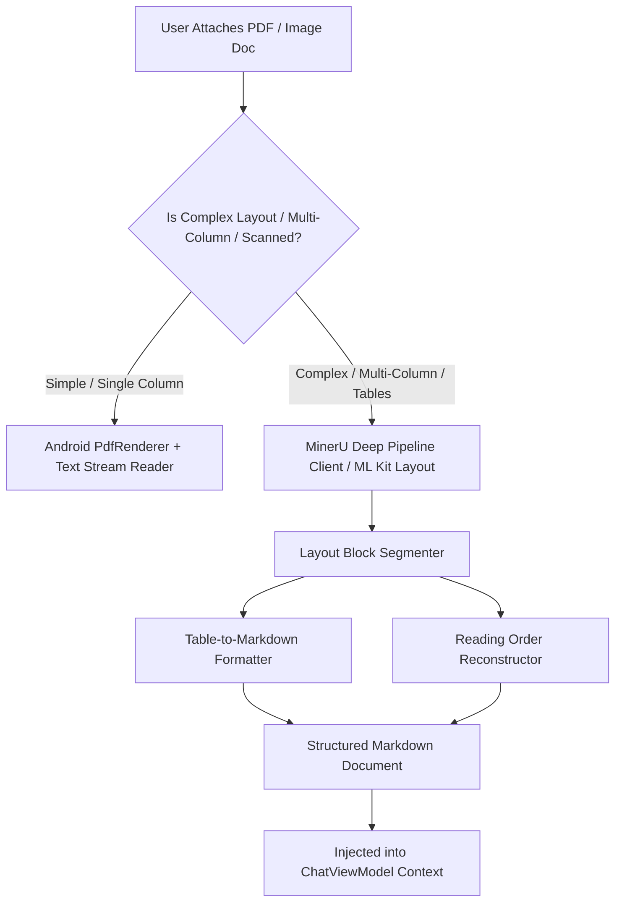

# Deep Technical Plan: MinerU Deep Document Parsing & Markdown Extraction (Kotlin Native)

## 1. Executive Summary & Source Analysis
- **Source Repository**: [`opendatalab/MinerU`](https://github.com/opendatalab/MinerU) (Magic-PDF High-Fidelity Document & Table Extraction Engine).
- **Core Mechanism**: Transforming complex unstructured documents (multi-column research PDFs, financial tables, scanned receipts, formulas, code snippets) into structured, LLM-ready Markdown and JSON without layout corruption or flattened tables.
- **Orbital Problem Solved**:
  - Upgrades [DocumentReader.kt](file:///c:/Jay/dev/Orbital/app/src/main/java/com/orbital/media/DocumentReader.kt) and [AttachmentPickerSheet.kt](file:///c:/Jay/dev/Orbital/app/src/main/java/com/orbital/ui/AttachmentPickerSheet.kt).
  - Handles complex PDFs attached by the user, preserving tabular relationships so the reasoning agent can answer questions accurately without hallucination.

---

## 2. Parsing Pipeline & Extraction Hierarchy



---

## 3. Kotlin Component Architecture (`com.orbital.media.parser`)

```
app/src/main/java/com/orbital/media/parser/
├── DocumentBlockModels.kt      # Block types: Heading, Paragraph, Table, Code, Formula
├── TableMarkdownFormatter.kt    # Converts detected table rows/cells into GitHub Markdown tables
├── LayoutOrderReconstructor.kt  # Fixes multi-column reading order from bounding boxes
├── LocalDocumentExtractor.kt    # On-device Android PDF & ML Kit OCR parser
├── MinerURemoteClient.kt       # Offloaded deep parser client for heavy multi-page PDFs
└── HybridDocumentPipeline.kt    # Intelligent router coordinating local vs remote parsing
```

---

## 4. Complete Kotlin Implementation Blueprint

### 4.1 Document Block Models (`DocumentBlockModels.kt`)

```kotlin
package com.orbital.media.parser

import android.graphics.RectF
import kotlinx.serialization.Serializable

enum class DocBlockType {
    TITLE,
    HEADING,
    PARAGRAPH,
    TABLE,
    CODE_BLOCK,
    FORMULA_LATEX,
    LIST_ITEM
}

@Serializable
data class DocBoundingBox(
    val left: Float,
    val top: Float,
    val right: Float,
    val bottom: Float,
    val pageIndex: Int
)

data class DocumentBlock(
    val id: String,
    val type: DocBlockType,
    val content: String,
    val boundingBox: DocBoundingBox?,
    val pageIndex: Int,
    val rawMarkdown: String
)

data class ParsedDocumentResult(
    val uri: String,
    val fileName: String,
    val pageCount: Int,
    val fullMarkdown: String,
    val blocks: List<DocumentBlock>,
    val tables: List<String>,
    val processingTimeMs: Long
)
```

### 4.2 Table to Markdown Formatter (`TableMarkdownFormatter.kt`)

```kotlin
package com.orbital.media.parser

object TableMarkdownFormatter {

    /**
     * Converts a 2D matrix of cell strings into a clean GitHub Flavored Markdown table.
     */
    fun formatToMarkdown(matrix: List<List<String>>): String {
        if (matrix.isEmpty() || matrix.all { it.isEmpty() }) return ""

        val columnCount = matrix.maxOf { it.size }
        val normalizedMatrix = matrix.map { row ->
            row + List(columnCount - row.size) { "" }
        }

        // Calculate max width per column for clean formatting
        val colWidths = IntArray(columnCount) { colIdx ->
            maxOf(3, normalizedMatrix.maxOf { row -> row[colIdx].trim().length })
        }

        val sb = StringBuilder()

        // 1. Header Row
        val header = normalizedMatrix.first()
        sb.append("|")
        for (i in header.indices) {
            sb.append(" ").append(header[i].trim().padEnd(colWidths[i])).append(" |")
        }
        sb.append("\n")

        // 2. Separator Row
        sb.append("|")
        for (i in header.indices) {
            sb.append("-").append("-".repeat(colWidths[i])).append("-|")
        }
        sb.append("\n")

        // 3. Data Rows
        for (rowIdx in 1 until normalizedMatrix.size) {
            val row = normalizedMatrix[rowIdx]
            sb.append("|")
            for (colIdx in row.indices) {
                sb.append(" ").append(row[colIdx].trim().padEnd(colWidths[colIdx])).append(" |")
            }
            sb.append("\n")
        }

        return sb.toString().trimEnd()
    }
}
```

### 4.3 Hybrid Document Pipeline (`HybridDocumentPipeline.kt`)

```kotlin
package com.orbital.media.parser

import android.content.Context
import android.net.Uri
import com.orbital.media.DocumentReader
import kotlinx.coroutines.Dispatchers
import kotlinx.coroutines.withContext

class HybridDocumentPipeline(
    private val localReader: DocumentReader,
    private val remoteMinerUClient: MinerURemoteClient? = null
) {
    suspend fun processDocument(
        context: Context,
        uri: Uri,
        mimeType: String,
        fileName: String
    ): ParsedDocumentResult = withContext(Dispatchers.IO) {
        val startTime = System.currentTimeMillis()

        // 1. Check if complex document and remote client is available
        val requiresDeepParsing = mimeType == "application/pdf" && remoteMinerUClient != null

        if (requiresDeepParsing) {
            try {
                return@withContext remoteMinerUClient!!.extractDeep(context, uri, fileName)
            } catch (e: Exception) {
                // Fallback gracefully to local parser on network or server error
            }
        }

        // 2. Local High-Speed Extraction
        val rawText = localReader.readDocument(context, uri, mimeType)
        val defaultBlock = DocumentBlock(
            id = "local_block_0",
            type = DocBlockType.PARAGRAPH,
            content = rawText,
            boundingBox = null,
            pageIndex = 0,
            rawMarkdown = rawText
        )

        ParsedDocumentResult(
            uri = uri.toString(),
            fileName = fileName,
            pageCount = 1,
            fullMarkdown = rawText,
            blocks = listOf(defaultBlock),
            tables = emptyList(),
            processingTimeMs = System.currentTimeMillis() - startTime
        )
    }
}
```

---

## 5. Integration with Existing Orbital Files
1. **`AttachmentPickerSheet.kt`**: Connect `HybridDocumentPipeline.processDocument()` to process user-selected PDF files asynchronously, displaying a preview card with table indicators.
2. **`AttachmentModels.kt`**: Add `parsedMarkdown: String?` and `extractedTables: List<String>` to `SelectedAttachment` data classes.
3. **`ChatViewModel.kt`**: Inject structured Markdown directly into prompt system turns when the user asks questions about attached files.
