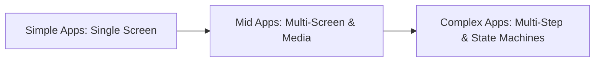

# 🛰️ Orbital Advanced Task-Based Testing & Complex Workflow Roadmap

**Target Scope:** Multi-Step Autonomous AI Workflows, File Operations, Dynamic App Testing (Simple, Mid, Complex), and Background Cron Automation  
**Harness:** On-Device Autonomous Agent (`AutonomousAgent.kt` / `ForemanSupervisor.kt`) + Orbital MCP Controller  

---

## 🎯 1. Overview of Task-Based Testing Pillars

```mermaid
graph TD
    subgraph "Pillar 1: File & Document Operations"
        P1_1[File Finding & Deep Search] --> P1_2[File Creation & Markdown Editing]
        P1_2 --> P1_3[Log Archival & Context Retrieval]
    end

    subgraph "Pillar 2: Multi-Tier App Flow Testing"
        P2_1[Tier 1: Simple Apps • Clock / Calc / Notes] --> P2_2[Tier 2: Mid Apps • Settings / YouTube / Gallery]
        P2_2 --> P2_3[Tier 3: Complex Apps • Browser / E-Commerce / Workflows]
    end

    subgraph "Pillar 3: Complex Cron & Background Automation"
        P3_1[WorkManager Cron Schedule Registration] --> P3_2[Battery & Charging Constrained Execution]
        P3_2 --> P3_3[Daily Briefing & Automated Multi-Step Synthesis]
    end
```

---

## 📋 2. Detailed Test Specifications by Pillar

---

### 📂 Pillar 1: File Operations & Document Manipulation

| Test ID | Category | Scenario / Task | Steps to Execute | Expected Validation |
| :--- | :--- | :--- | :--- | :--- |
| **`TASK-FILE-01`** | **File Finding** | Find specific documents or log files in device storage | 1. Dispatch prompt: `"Find the latest test results report in storage"` 2. Agent searches standard directories (`/sdcard/Download`, `Documents`, app internal). | Returns absolute path, file size, and creation timestamp. |
| **`TASK-FILE-02`** | **File Editing** | Create and modify a structured Markdown note | 1. Prompt: `"Create a meeting note summary.md with action items"` 2. Agent writes content, then appends follow-up items. | File exists, content verified, no data corruption. |
| **`TASK-FILE-03`** | **Data Extraction** | Read and summarize structured JSON / CSV / Text | 1. Prompt: `"Read test_results.json and extract pass percentage"` 2. Agent parses file content and renders structured summary. | Exact numeric values extracted and presented in chat card. |

---

### 📱 Pillar 2: Multi-Tier App Lifecycle & Flow Testing

#### Tier 1: Simple Applications (Single Screen / Direct Actions)
* **Target Apps:** Clock (`com.google.android.deskclock`), Calculator (`com.google.android.calculator`), Simple Notepad.
* **Test Workflows:**
  - **`APP-SIMP-01 (Timer)`**: Launch Clock -> Navigate to Timer tab -> Input 25 minutes -> Tap Start.
  - **`APP-SIMP-02 (Calculator)`**: Launch Calculator -> Calculate `125 * 8` -> Assert result displays `1000`.

#### Tier 2: Mid-Tier Applications (Multi-Tab / Media / Search Navigation)
* **Target Apps:** Settings (`com.android.settings`), YouTube, Media Gallery.
* **Test Workflows:**
  - **`APP-MID-01 (Settings Navigation)`**: Launch Settings -> Search "Display" -> Open Brightness -> Inspect current level.
  - **`APP-MID-02 (YouTube Search)`**: Launch YouTube -> Tap Search -> Type "Lo-Fi Beats" -> Select first video.

#### Tier 3: Complex Applications (Multi-Step Workflows / Browser / Form Entry)
* **Target Apps:** Chrome / Web Browser, Form Fillers, Productivity suites.
* **Test Workflows:**
  - **`APP-CMPLX-01 (Web Research & Extraction)`**: Launch Browser -> Navigate to a search query -> Extract top 3 headlines -> Return to Orbital and summarize.
  - **`APP-CMPLX-02 (Dynamic App Installation & First Launch)`**: Trigger download/install of an APK -> Detect package install complete event -> Launch app -> Complete initial permissions grant.

---

### ⏰ Pillar 3: Complex Background Cron Jobs & WorkManager Tasks

| Test ID | Automation Task | Trigger Constraint | Execution Sequence | Verification |
| :--- | :--- | :--- | :--- | :--- |
| **`CRON-TASK-01`** | **Nightly Interaction Summary** | Cron expression: `0 23 * * *` (11:00 PM) + `Charging = true` | 1. Wakes via `WorkManager` 2. Reads 24h conversation history from Room DB 3. Generates concise summary note 4. Stores in episodic memory store. | Summary file written to storage; notification posted to status bar. |
| **`CRON-TASK-02`** | **Periodic Health & Storage Diagnostic** | Every 6 hours + `BatteryNotLow` | 1. Inspects battery temperature, available RAM, and storage 2. Flags warnings if storage < 5GB or temp > 45°C. | Telemetry entry logged in `DeviceStatusRepository`. |
| **`CRON-TASK-03`** | **Automated Multi-Step Cleanup Routine** | Recurring 24-hour job | 1. Scans `/tmp` and screenshot cache directories 2. Recycles bitmaps and purges temp screen dumps older than 48h. | Storage reclaimed; memory leaks prevented. |

---

## 🚀 3. Execution Strategy & Next Steps

1. **Step 1: Setup Test Environments & Test Data** (Create test sample files and verify app accessibility permissions).
2. **Step 2: Execute Pillar 1 (File Finding & Editing Tasks)**.
3. **Step 3: Execute Pillar 2 (Simple -> Mid -> Complex App Automation Flows)**.
4. **Step 4: Execute Pillar 3 (Complex Cron Job Scheduling & Autonomous Background Execution)**.
5. **Step 5: Generate Verified Trace Artifacts & Comprehensive Test Run Logs**.
